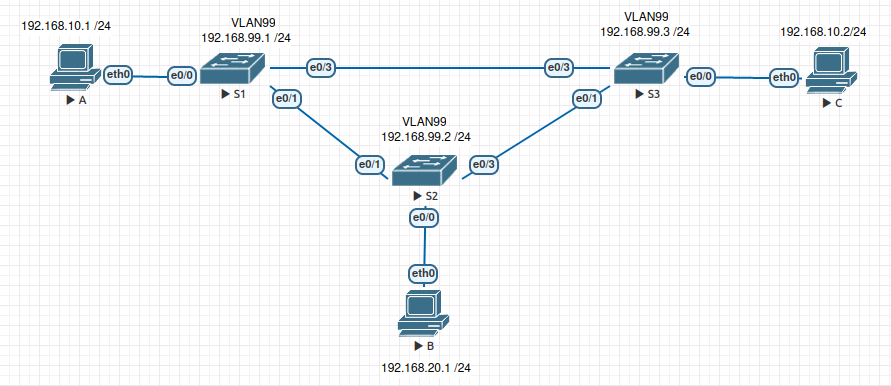

 ## Лабораторная работа. Настройка расширенных сетей VLAN, VTP и DTP

#### Топология




#### Таблица адресации

| Заголовок таблицы | Интерфейс | IP-адрес     | Маска подсети |
| ----------------- | --------- | ------------ | ------------- |
| S1                | VLAN 99   | 192.168.99.1 | 255.255.255.0 |
| S2                | VLAN 99   | 192.168.99.2 | 255.255.255.0 |
| S3                | VLAN 99   | 192.168.99.3 | 255.255.255.0 |
| PC-A              | NIC       | 192.168.10.1 | 255.255.255.0 |
| PC-B              | NIC       | 192.168.20.1 | 255.255.255.0 |
| PC-C              | NIC       | 192.168.10.2 | 255.255.255.0 |


#### **Домашнее задание**

##### VLAN

**Цель:** Настройка VTP Настройка DTP Добавление сетей VLAN и назначение портов Настройка расширенной сети VLAN 

В этой лабораторной работе вы настроите магистральные каналы между этими коммутаторами
 Все коммутаторы будут настроены на использование VTP для обновлений сетей VLAN. S2 будет настроен в качестве сервера. 
 Настройка динамического протокола транкинга (DTP)
 Добавление сетей VLAN и назначение портов
 В 4 части вам предстоит перевести VTP на коммутаторе S1 в прозрачный режим и создать сеть VLAN расширенного диапазона на коммутаторе S1.

#### Создание сети и настройка основных параметров устройства:

1. Создать сеть согласно топологии(уже соединил согсно схеме)

 <details>
<summary>S1</summary>
<pre><code>
Enable
Configure terminal
interface vlan 1
ip address 192.168.1.1 255.255.255.0
no shutdown
exit
hostname S1
do copy run start 
</code></pre>
</details>
 <details>
<summary>S2</summary>
<pre><code>
Enable
Configure terminal
interface vlan 1
ip address 192.168.1.2 255.255.255.0
no shutdown
exit
hostname S2
do copy run start 
</code></pre>
</details>
 <details>
<summary>S3</summary>
<pre><code>
Enable
Configure terminal
interface vlan 1
ip address 192.168.1.3 255.255.255.0
no shutdown
exit
hostname S3
do copy run start 
</code></pre>
</details>
2. Чтобы отключить поиск по DNS на каждом коммутаторе прописываем в режиме конфигурации

   ```
   no ip domain-lookup
   ```
3. В режиме конфигурации пропишем : пароль на расширенный режим, и на вход устройства ,а также синхронизацию CLI . 
 <details>
<summary>S1,S2,S3</summary>
<pre><code>
no ip domain-lookup
enable secret cisco
line console 0
password cisco
login 
logging synchronous
</code></pre>
</details>

4. Настроим баннер при входе, при входе на устройство
 <details>
<summary>S1,S2,S3</summary>
<pre><code>
Banner motd “**This is a secure system. Authorized Access Only!
</code></pre>
</details>
5. Заводим протокол VTP на коммутаторах

 <details>
<summary>S1</summary>
<pre><code>
vtp domain CCNA
vtp password cisco
vtp version 3
vtp mode client
</code></pre>
</details>
 <details>
<summary>S2</summary>
<pre><code>
vtp domain CCNA
vtp password cisco
vtp version 3
vtp mode server
end
vtp primary server force
</code></pre>
</details>
 <details>
<summary>S3</summary>
<pre><code>
vtp domain CCNA
vtp password cisco
vtp version 3
vtp mode client
</code></pre>
</details>
6. Переведем порты в режим TRUNK для того,чтобы работал протокол VTP

 <details>
<summary>S1,S2,S3</summary>
<pre><code>
interface  Ethernet 0/3
switchport trunk encapsulation dot1q
switchport mode trunk
interface  Ethernet 0/1
switchport trunk encapsulation dot1q
switchport mode trunk
</code></pre>
</details>
```
show interfaces trunk  
```
<details>
<summary>S3</summary>
<pre><code>
Port        Mode             Encapsulation  Status        Native vlan
Et0/1       on               802.1q         trunking      1
Et0/3       on               802.1q         trunking      1
</code></pre>
</details>
7. На коммутаторе S2 (сервер VTP домена) заведём новые VLAN

 <details>
<summary>S2</summary>
<pre><code>
vlan 999
name VTP_Lab
vlan 10 
name Red
vlan 20
name Blue
vlan 30
name Yellow
vlan 99
name Management  
</code></pre>
</details>
Посмотрим добавились ли VLAN на других устройствах
 <details>
<summary>S1</summary>
<pre><code>
S3# show vlan brief  
!
VLAN Name                             Status    Ports
---- -------------------------------- --------- -------------------------------
1    default                          active    Et0/0, Et0/2
10   Red                              active    
20   Blue                             active    
30   Yellow                           active    
999  VTP_Lab                          active    
1002 fddi-default                     act/unsup 
1003 trcrf-default                    act/unsup 
1004 fddinet-default                  act/unsup 
1005 trbrf-default                    act/unsup 
</code></pre>
</details>
 <details>
<summary>S3</summary>
<pre><code>
S3# show vlan brief  
!
VLAN Name                             Status    Ports
---- -------------------------------- --------- -------------------------------
1    default                          active    Et0/0, Et0/2
10   Red                              active    
20   Blue                             active    
30   Yellow                           active    
999  VTP_Lab                          active    
1002 fddi-default                     act/unsup 
1003 trcrf-default                    act/unsup 
1004 fddinet-default                  act/unsup 
1005 trbrf-default                    act/unsup 
</code></pre>
</details>

8. Проверим утилитой ping связанность ПК A-C
<details>
<summary>PC A</summary>
<pre><code>
VPCS> show ip
NAME        : VPCS[1]
IP/MASK     : 192.168.10.1/24
GATEWAY     : 0.0.0.0
DNS         : 
MAC         : 00:50:79:66:68:04
LPORT       : 20000
RHOST:PORT  : 127.0.0.1:30000
MTU         : 1500
!
VPCS> ping 192.168.10.2
!
84 bytes from 192.168.10.2 icmp_seq=1 ttl=64 time=0.722 ms
84 bytes from 192.168.10.2 icmp_seq=2 ttl=64 time=1.135 ms
84 bytes from 192.168.10.2 icmp_seq=3 ttl=64 time=1.121 ms
84 bytes from 192.168.10.2 icmp_seq=4 ttl=64 time=1.088 ms
84 bytes from 192.168.10.2 icmp_seq=5 ttl=64 time=1.197 ms
</code></pre>
</details>

 <details>
<summary>PC c</summary>
<pre><code>
VPCS> ping 192.168.10.1
84 bytes from 192.168.10.1 icmp_seq=1 ttl=64 time=0.822 ms
84 bytes from 192.168.10.1 icmp_seq=2 ttl=64 time=1.187 ms
84 bytes from 192.168.10.1 icmp_seq=3 ttl=64 time=1.427 ms
84 bytes from 192.168.10.1 icmp_seq=4 ttl=64 time=1.186 ms
84 bytes from 192.168.10.1 icmp_seq=5 ttl=64 time=1.085 ms
!
VPCS> show ip
!
NAME        : VPCS[1]
IP/MASK     : 192.168.10.2/24
GATEWAY     : 0.0.0.0
DNS         : 
MAC         : 00:50:79:66:68:06
LPORT       : 20000
RHOST:PORT  : 127.0.0.1:30000
MTU         : 1500
</code></pre>
</details>