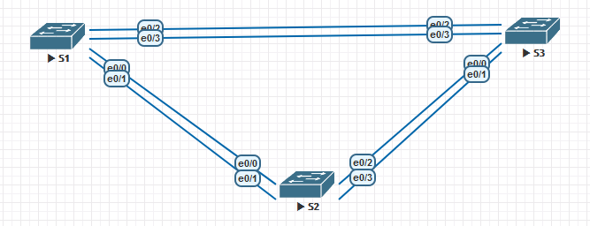
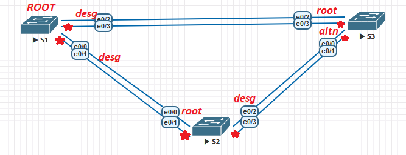
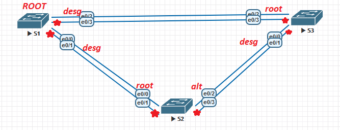
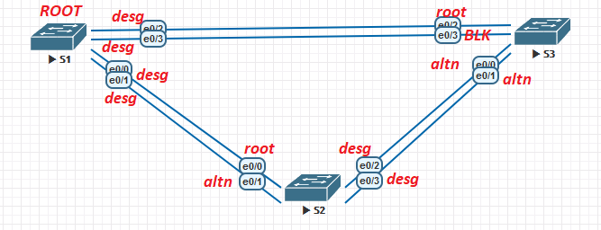

## Лабораторная работа. Развертывание коммутируемой сети с резервными каналами

### Топология

### Таблица адресации

| Устройство | Интерфейс | IP-адрес    | Маска подсети |
| ---------- | --------- | ----------- | ------------- |
| S1         | VLAN 1    | 192.168.1.1 | 255.255.255.0 |
| S2         | VLAN 1    | 192.168.1.2 | 255.255.255.0 |
| S3         | VLAN 1    | 192.168.1.3 | 255.255.255.0 |

### Цели:

**Часть 1.** Создание сети и настройка основных параметров устройства
**Часть 2.** Выбор корневого моста
**Часть 3.** Наблюдение за процессом выбора протоколом STP порта, исходя из стоимости портов
**Часть 4.** Наблюдение за процессом выбора протоколом STP порта, исходя из приоритета портов

### Создание сети и настройка основных параметров устройства

Построим сеть согласно топологии , пропишем имена устройств ,а также назначим IP на VLAN 1 интерфейсе.

S1

<pre><code>
enable
conf t
host S1
line con 0
exec-t 0 0
exit
int vlan 1
ip add 192.168.1.1 255.255.255.0
no shut 
</code></pre>

 

S2

<pre><code>
enable
conf t
host S2
line con 0
exec-t 0 0
exit
int vlan 1
ip add 192.168.1.2 255.255.255.0
no shut
</code></pre>

 

S3

<pre><code>
enable
conf t
host S3
line con 0
exec-t 0 0
exit
int vlan 1
ip add 192.168.1.3 255.255.255.0
no shut 
</code></pre>

Отключим DNS поиск и также назначим пароли на привилегированному режиму,а также на VTY консоли, logging synchronous для консольной линии.

S1,S2,S3

<pre><code>
no ip domain-lookup
enable secret cisco
line console 0
password cisco
login 
logging synchronous
banner motd “**This is a secure system. Authorized Access Only!**"'b'
</code></pre>

Проверим связь между свичами

S1

<pre><code>
S1#ping 192.168.1.1
Type escape sequence to abort.
Sending 5, 100-byte ICMP Echos to 192.168.1.1, timeout is 2 seconds:
!!!!!
Success rate is 100 percent (5/5), round-trip min/avg/max = 4/4/5 ms
S1#ping 192.168.1.2
Type escape sequence to abort.
Sending 5, 100-byte ICMP Echos to 192.168.1.2, timeout is 2 seconds:
.!!!!
Success rate is 80 percent (4/5), round-trip min/avg/max = 1/1/1 ms
S1#ping 192.168.1.3
Type escape sequence to abort.
Sending 5, 100-byte ICMP Echos to 192.168.1.3, timeout is 2 seconds:
.!!!!
Success rate is 80 percent (4/5), round-trip min/avg/max = 1/3/5 ms
</code></pre>

### Определение корневого моста

Настраиваем порты в режим **trunk**

S1,S2,S3

<pre><code>
conf t
int ran e0/0-3
sw tr en d
sw m tr
exit
</code></pre>

Отключаем лишние порты, пусть это будет e0/1 и e0/3

S1,S2,S3

<pre><code>
int e0/1
shut
int e0/3
shut
exit
</code></pre>

Отображаем данные по STP

S1

<pre><code>
S1(config)#do sh span
!
VLAN0001
  Spanning tree enabled protocol ieee
  Root ID    Priority    32769
             Address     aabb.cc00.1000
             This bridge is the root
             Hello Time   2 sec  Max Age 20 sec  Forward Delay 15 sec
!
  Bridge ID  Priority    32769  (priority 32768 sys-id-ext 1)
             Address     aabb.cc00.1000
             Hello Time   2 sec  Max Age 20 sec  Forward Delay 15 sec
             Aging Time  300 sec
!
Interface           Role Sts Cost      Prio.Nbr Type
------------------- ---- --- --------- -------- --------------------------------
Et0/0               Desg FWD 100       128.1    P2p 
Et0/2               Desg FWD 100       128.3    P2p 
</code></pre>

S2

<pre><code>
S2(config)#do sh span
!
VLAN0001
  Spanning tree enabled protocol ieee
  Root ID    Priority    32769
             Address     aabb.cc00.1000
             Cost        100
             Port        1 (Ethernet0/0)
             Hello Time   2 sec  Max Age 20 sec  Forward Delay 15 sec
!
  Bridge ID  Priority    32769  (priority 32768 sys-id-ext 1)
             Address     aabb.cc00.2000
             Hello Time   2 sec  Max Age 20 sec  Forward Delay 15 sec
             Aging Time  300 sec
!
Interface           Role Sts Cost      Prio.Nbr Type
------------------- ---- --- --------- -------- --------------------------------
Et0/0               Root FWD 100       128.1    P2p 
Et0/2               Desg FWD 100       128.3    P2p 
</code></pre>

S3

<pre><code>
S3(config)#do sh span
!
VLAN0001
  Spanning tree enabled protocol ieee
  Root ID    Priority    32769
             Address     aabb.cc00.1000
             Cost        100
             Port        3 (Ethernet0/2)
             Hello Time   2 sec  Max Age 20 sec  Forward Delay 15 sec
!
  Bridge ID  Priority    32769  (priority 32768 sys-id-ext 1)
             Address     aabb.cc00.3000
             Hello Time   2 sec  Max Age 20 sec  Forward Delay 15 sec
             Aging Time  300 sec
!
Interface           Role Sts Cost      Prio.Nbr Type
------------------- ---- --- --------- -------- --------------------------------
Et0/0               Altn BLK 100       128.1    P2p 
Et0/2               Root FWD 100       128.3    P2p 
</code></pre>

Теперь нагляднее :

звездочка красная это порт выключен ( disabled )

Root выбирается на основе MAC адреса и BID Priority(по  умолчанию 32769), наименьший адрес устройства MAC побеждает в выборах.   Порт e0/0 на S3 был заблокирован STP и данные по нему не будут ходить.

### Наблюдение за процессом выбора протоколом STP порта, исходя из стоимости портов

Так как информацию по STP и его портам мы имеем ,то сейчас мы будем наблюдать, как будет меняться топология исходя из стоимости портов. По  умолчанию стоимость Ethernet = 100 ,посмотрим как измениться  топология,когда мы на S3  изменим стоимость порта в сторону root.

S3

<pre><code>
int e0/2
spanning-tree cost 90
exit
</code></pre>

Выведем состояние STP в порядке S1,S2,S3.

S1

<pre><code>
S1(config)#do sh span
!
VLAN0001
  Spanning tree enabled protocol ieee
  Root ID    Priority    32769
             Address     aabb.cc00.1000
             This bridge is the root
             Hello Time   2 sec  Max Age 20 sec  Forward Delay 15 sec
!
  Bridge ID  Priority    32769  (priority 32768 sys-id-ext 1)
             Address     aabb.cc00.1000
             Hello Time   2 sec  Max Age 20 sec  Forward Delay 15 sec
             Aging Time  300 sec
!
Interface           Role Sts Cost      Prio.Nbr Type
------------------- ---- --- --------- -------- --------------------------------
Et0/0               Desg FWD 100       128.1    P2p 
Et0/2               Desg FWD 100       128.3    P2p 
</code></pre>

S2

<pre><code>
S2(config)#do sh span
!
VLAN0001
  Spanning tree enabled protocol ieee
  Root ID    Priority    32769
             Address     aabb.cc00.1000
             Cost        100
             Port        1 (Ethernet0/0)
             Hello Time   2 sec  Max Age 20 sec  Forward Delay 15 sec
!
  Bridge ID  Priority    32769  (priority 32768 sys-id-ext 1)
             Address     aabb.cc00.2000
             Hello Time   2 sec  Max Age 20 sec  Forward Delay 15 sec
             Aging Time  300 sec
!
Interface           Role Sts Cost      Prio.Nbr Type
------------------- ---- --- --------- -------- --------------------------------
Et0/0               Root FWD 100       128.1    P2p 
Et0/2               Altn BLK 100       128.3    P2p 
</code></pre>

S3

<pre><code>
S3(config)#do sh sp
!
VLAN0001
  Spanning tree enabled protocol ieee
  Root ID    Priority    32769
             Address     aabb.cc00.1000
             Cost        90
             Port        3 (Ethernet0/2)
             Hello Time   2 sec  Max Age 20 sec  Forward Delay 15 sec
!
  Bridge ID  Priority    32769  (priority 32768 sys-id-ext 1)
             Address     aabb.cc00.3000
             Hello Time   2 sec  Max Age 20 sec  Forward Delay 15 sec
             Aging Time  15  sec
!
Interface           Role Sts Cost      Prio.Nbr Type
------------------- ---- --- --------- -------- --------------------------------
Et0/0               Desg LIS 100       128.1    P2p 
Et0/2               Root FWD 90        128.3    P2p 
</code></pre>

Как видим порты поменялись местами . Теперь вернем как и было.

S3

<pre><code>
int e0/2
no spanning-tree cost 90
exit
</code></pre>

### Наблюдение за процессом выбора протоколом STP порта, исходя из приоритета портов

Включаем отключенные ранее порты на коммутаторах

S1,S2,S3

<pre><code>
int e0/1
no shut
int e0/3
no shut
exit
</code></pre>

Проверим состояние STP сейчас

 

S1

<pre><code>
S1(config)#do show spanning-tree
!
VLAN0001
  Spanning tree enabled protocol ieee
  Root ID    Priority    32769
             Address     aabb.cc00.1000
             This bridge is the root
             Hello Time   2 sec  Max Age 20 sec  Forward Delay 15 sec
!
  Bridge ID  Priority    32769  (priority 32768 sys-id-ext 1)
             Address     aabb.cc00.1000
             Hello Time   2 sec  Max Age 20 sec  Forward Delay 15 sec
             Aging Time  15  sec
!
Interface           Role Sts Cost      Prio.Nbr Type
------------------- ---- --- --------- -------- --------------------------------
Et0/0               Desg FWD 100       128.1    P2p 
Et0/1               Desg FWD 100       128.2    P2p 
Et0/2               Desg FWD 100       128.3    P2p 
Et0/3               Desg FWD 100       128.4    P2p 
</code></pre>

 

S2

<pre><code>
S2(config)#do show spanning-tree
!
VLAN0001
  Spanning tree enabled protocol ieee
  Root ID    Priority    32769
             Address     aabb.cc00.1000
             Cost        100
             Port        1 (Ethernet0/0)
             Hello Time   2 sec  Max Age 20 sec  Forward Delay 15 sec
!
  Bridge ID  Priority    32769  (priority 32768 sys-id-ext 1)
             Address     aabb.cc00.2000
             Hello Time   2 sec  Max Age 20 sec  Forward Delay 15 sec
             Aging Time  15  sec
!
Interface           Role Sts Cost      Prio.Nbr Type
------------------- ---- --- --------- -------- --------------------------------
Et0/0               Root FWD 100       128.1    P2p 
Et0/1               Altn BLK 100       128.2    P2p 
Et0/2               Desg FWD 100       128.3    P2p 
Et0/3               Desg FWD 100       128.4    P2p 
</code></pre>

S3

<pre><code>
S3(config)#do show spanning-tree
!
VLAN0001
  Spanning tree enabled protocol ieee
  Root ID    Priority    32769
             Address     aabb.cc00.1000
             Cost        100
             Port        3 (Ethernet0/2)
             Hello Time   2 sec  Max Age 20 sec  Forward Delay 15 sec
!
  Bridge ID  Priority    32769  (priority 32768 sys-id-ext 1)
             Address     aabb.cc00.3000
             Hello Time   2 sec  Max Age 20 sec  Forward Delay 15 sec
             Aging Time  15  sec
!
Interface           Role Sts Cost      Prio.Nbr Type
------------------- ---- --- --------- -------- --------------------------------
Et0/0               Altn BLK 100       128.1    P2p 
Et0/1               Altn BLK 100       128.2    P2p 
Et0/2               Root FWD 100       128.3    P2p 
Et0/3               Altn BLK 100       128.4    P2p 
</code></pre>

Коммутатор S1 корневой,а это значит,что все его порты desg . Также  видим, что каждый коммутатор в сторону корневого выбрал по 1  порту в качестве root на основе номера порта и его стоимости.  А также  выделил альтернативный и заблокированный порт. Что касается направления S2 и S3 ,то там выбор desg и altn , чтобы не  создавать петли.

1. Какое значение протокол STP использует первым после выбора корневого моста, чтобы определить выбор порта?

   Поиск портов в сторону коммутатора root, то есть  кротчайшие пути,которые зависят от скорости соединения и количества  промежуточных коммутаторов.

2. Если первое значение на двух портах одинаково, какое следующее значение будет использовать протокол STP при выборе порта?

   Если стоимости портов равны, процесс сравнивает BID. Если  BID равны, для определения корневого моста используются приоритеты  портов. Значение приоритета по умолчанию — 128,отключается порт с  большим значением.

3. Если оба значения на двух портах равны, каким будет следующее значение, которое использует протокол STP при выборе порта?

   в этом случае STP использует номер наименьшего порта .
