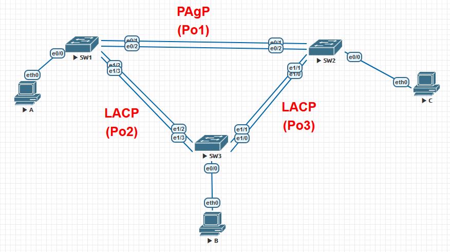

## Лабораторная работа. Настройка EtherChannel 

### Топология



### Таблица адресации

| Устройство | Интерфейс | IP-адрес      | Маска подсети |
| ---------- | --------- | ------------- | ------------- |
| S1         | VLAN 99   | 192.168.99.11 | 255.255.255.0 |
| S2         | VLAN 99   | 192.168.99.12 | 255.255.255.0 |
| S3         | VLAN 99   | 192.168.99.13 | 255.255.255.0 |
| PC-A       | NIC       | 192.168.10.1  | 255.255.255.0 |
| PC-B       | NIC       | 192.168.10.2  | 255.255.255.0 |
| PC-C       | NIC       | 192.168.10.3  | 255.255.255.0 |

### Цели

**Часть 1. Настройка базовых параметров коммутатора**
**Часть 2. Настройка PAgP**
**Часть 3. Настройка LACP**

### Настройка базовых параметров коммутатора

Для начало настроим имя устройства:

<details>
<summary>S1</summary>
<pre><code>
enable
conf t
hos S1
</code></pre>
</details>
<details>
<summary>S2</summary>
<pre><code>
enable
conf t
hos S2
</code></pre>
</details>
<details>
<summary>S3</summary>
<pre><code>
enable
conf t
hos S3
</code></pre>
</details>
Зададим IP адресацию для устройств согласно условию:

<details>
<summary>S1</summary>
<pre><code>
int vla 99
ip addr 192.168.99.11 255.255.255.0
no shut
exit 
</code></pre>
</details>
<details>
<summary>S2</summary>
<pre><code>
int vla 99
ip addr 192.168.99.12 255.255.255.0
no shut
exit 
</code></pre>
</details>
<details>
<summary>S3</summary>
<pre><code>
int vla 99
ip addr 192.168.99.13 255.255.255.0
no shut
exit 
</code></pre>
</details>

Отключим поиск DNS , зашифруем пароли ,а также назначим баннерное сообщение:

<details>
<summary>S1,S2,S3</summary>
<pre><code>
no ip domain-loo
service password-encryption
Banner motd "This is a secure system. Authorized Access Only!" 
</code></pre>
</details>
Зададим пароль на привилегированный режим , консольный режим и на VTY ,а также сервис по синхронной регистрации.
<details>
<summary>S1,S2,S3</summary>
<pre><code>
enable secret class
line vty 0 4
logging synchronous
password cisco
login
exit
line con 0
exec-timeout 0 0
logging synchronous
password cisco
login
exit 
</code></pre>
</details>

Отключим все порты на устройстве, кроме тех,что смотрят в сторону ПК
<details>
<summary>S1,S2,S3</summary>
<pre><code>
int ran e0/1-3
shut
int ran e1/0-3
shut 
</code></pre>
</details>
создадим VLAN 99 , 10 именем **Management** и **Staff** соответственно
<details>
<summary>S1,S2,S3</summary>
<pre><code>
vlan 99
name Management
vlan 10
name Staff 
</code></pre>
</details>
Настроим порты коммутатора с присоединёнными узлами в качестве портов доступа к сети VLAN 10:
<details>
<summary>S1,S2,S3</summary>
<pre><code>
int e0/0
sw m ac
sw ac vl 10
</code></pre>
</details>
Сохраним конфигурацию:

<details>
<summary>S1,S2,S3</summary>
<pre><code>
do copy run start
[Enter]
</code></pre>
</details>

Пропишем на ПК:

<details>
<summary>A</summary>
<pre><code>
ip 192.168.10.1/24
save 
</code></pre>
</details>
<details>
<summary>B</summary>
<pre><code>
 ip 192.168.10.2/24
save 
</code></pre>
</details>
<details>
<summary>C</summary>
<pre><code>
ip 192.168.10.3/24
save 
</code></pre>
</details>

### Настройка протокола PAgP

Настроим для S1 и S2 PAgP :

<details>
<summary>S1</summary>
<pre><code>
int ran e0/1-2
channel-group 1 mode desirable
no shut
exit
</code></pre>
</details>
<details>
<summary>S2</summary>
<pre><code>
int ran e0/1-2
channel-group 1 mode auto
no shut 
exit
</code></pre>
</details>

Проверка конфигурации на портах для S1 и S2

```
do show run interface e0/1
```
<details>
<summary>S1</summary>
<pre><code>
do show run interface e0/1
!
interface Ethernet0/1
 channel-group 1 mode desirable
end
</code></pre>
</details>
<details>
<summary>S2</summary>
<pre><code>
do show run interface e0/1
!
interface Ethernet0/1
 channel-group 1 mode auto
end
</code></pre>
</details>
```
do show interfaces e0/1 switchport
```

<details>
<summary>S1</summary>
<pre><code>
do show interfaces e0/1 switchport
!
Name: Et0/1
Switchport: Enabled
Administrative Mode: dynamic auto
Operational Mode: static access (member of bundle Po1)
Administrative Trunking Encapsulation: negotiate
Operational Trunking Encapsulation: native
Negotiation of Trunking: On
Access Mode VLAN: 1 (default)
Trunking Native Mode VLAN: 1 (default)
Administrative Native VLAN tagging: enabled
Voice VLAN: none
Administrative private-vlan host-association: none
Administrative private-vlan mapping: none
Administrative private-vlan trunk native VLAN: none
Administrative private-vlan trunk Native VLAN tagging: enabled
Administrative private-vlan trunk encapsulation: dot1q
Administrative private-vlan trunk normal VLANs: none
Administrative private-vlan trunk associations: none
Administrative private-vlan trunk mappings: none
Operational private-vlan: none
Trunking VLANs Enabled: ALL
Pruning VLANs Enabled: 2-1001
Capture Mode Disabled
Capture VLANs Allowed: ALL
!
Protected: false
Appliance trust: none
</code></pre>
</details>
<details>
<summary>S2</summary>
<pre><code>
do show interfaces e0/1 switchport
!
Name: Et0/1
Switchport: Enabled
Administrative Mode: dynamic auto
Operational Mode: static access (member of bundle Po1)
Administrative Trunking Encapsulation: negotiate
Operational Trunking Encapsulation: native
Negotiation of Trunking: On
Access Mode VLAN: 1 (default)
Trunking Native Mode VLAN: 1 (default)
Administrative Native VLAN tagging: enabled
Voice VLAN: none
Administrative private-vlan host-association: none
Administrative private-vlan mapping: none
Administrative private-vlan trunk native VLAN: none
Administrative private-vlan trunk Native VLAN tagging: enabled
Administrative private-vlan trunk encapsulation: dot1q
Administrative private-vlan trunk normal VLANs: none
Administrative private-vlan trunk associations: none
Administrative private-vlan trunk mappings: none
Operational private-vlan: none
Trunking VLANs Enabled: ALL
Pruning VLANs Enabled: 2-1001
Capture Mode Disabled
Capture VLANs Allowed: ALL
!
Protected: false
Appliance trust: none
</code></pre>
</details>

Убеждаемся, что порты объединены

```
do show etherchannel summary
```

<details>
<summary>S1</summary>
<pre><code>
do show etherchannel summary
!
Flags:  
D - down	P - bundled in port-channel
I - stand-alone	s - suspended
H - Hot-standby (LACP only)
R - Layer3      S - Layer2
U - in use      N - not in use, no aggregation
f - failed to allocate aggregator
M - not in use, minimum links not met
m - not in use, port not aggregated due to minimum links not met
u - unsuitable for bundling
w - waiting to be aggregated
d - default port    
A - formed by Auto LAG
!
!
Number of channel-groups in use: 1
Number of aggregators:           1
!
Group  Port-channel  Protocol    Ports
------+-------------+-----------+-----------------------------------------------
1      Po1(SU)         PAgP      Et0/1(P)    Et0/2(P)
</code></pre>
</details>
<details>
<summary>S2</summary>
<pre><code>
do show etherchannel summary
!
Flags:  
D - down	P - bundled in port-channel
I - stand-alone	s - suspended
H - Hot-standby (LACP only)
R - Layer3      S - Layer2
U - in use      N - not in use, no aggregation
f - failed to allocate aggregator
M - not in use, minimum links not met
m - not in use, port not aggregated due to minimum links not met
u - unsuitable for bundling
w - waiting to be aggregated
d - default port    
A - formed by Auto LAG
!
!
Number of channel-groups in use: 1
Number of aggregators:           1
!
Group  Port-channel  Protocol    Ports
------+-------------+-----------+-----------------------------------------------
1      Po1(SU)         PAgP      Et0/1(P)    Et0/2(P)
</code></pre>
</details>

Настройте транковые порты.

<details>
<summary>S1,S2</summary>
<pre><code>
interface port-channel 1
switchport trunk encapsulation dot1q
switchport mode trunk
switchport trunk native vlan 99
</code></pre>
</details>

Убедитесь в том, что порты настроены в качестве транковых.

```
do show run interface e0/1
```

<details>
<summary>S1,S2</summary>
<pre><code>
do show run interface e0/1
!
interface Ethernet0/1
 switchport trunk encapsulation dot1q
 switchport trunk native vlan 99
 switchport mode trunk
 channel-group 1 mode desirable
end
</code></pre>
</details>

```
do show interfaces trunk
```

<details>
<summary>S1,S2</summary>
<pre><code>
do show interfaces trunk
!
Port        Mode             Encapsulation  Status        Native vlan
Po1         on               802.1q         trunking      99
!
Port        Vlans allowed on trunk
Po1         1-4094
!
Port        Vlans allowed and active in management domain
Po1         1,10,99
!
Port        Vlans in spanning tree forwarding state and not pruned
Po1         1,10,99
</code></pre>
</details>

```
do show spanning-tree 
```
<details>
<summary>S1</summary>
<pre><code>
do show spanning-tree
!
VLAN0001
  Spanning tree enabled protocol ieee
  Root ID    Priority    32769
             Address     aabb.cc00.1000
             This bridge is the root
             Hello Time   2 sec  Max Age 20 sec  Forward Delay 15 sec
!
  Bridge ID  Priority    32769  (priority 32768 sys-id-ext 1)
             Address     aabb.cc00.1000
             Hello Time   2 sec  Max Age 20 sec  Forward Delay 15 sec
             Aging Time  300 sec
!
Interface           Role Sts Cost      Prio.Nbr Type
------------------- ---- --- --------- -------- --------------------------------
Po1                 Desg FWD 56        128.65   P2p
!
!
!
VLAN0010
  Spanning tree enabled protocol ieee
  Root ID    Priority    32778
             Address     aabb.cc00.1000
             This bridge is the root
             Hello Time   2 sec  Max Age 20 sec  Forward Delay 15 sec
!
  Bridge ID  Priority    32778  (priority 32768 sys-id-ext 10)
             Address     aabb.cc00.1000
             Hello Time   2 sec  Max Age 20 sec  Forward Delay 15 sec
             Aging Time  300 sec
!
Interface           Role Sts Cost      Prio.Nbr Type
------------------- ---- --- --------- -------- --------------------------------
Et0/0               Desg FWD 100       128.1    P2p
Po1                 Desg FWD 56        128.65   P2p
!
!
!
VLAN0099
  Spanning tree enabled protocol ieee
  Root ID    Priority    32867
             Address     aabb.cc00.1000
             This bridge is the root
             Hello Time   2 sec  Max Age 20 sec  Forward Delay 15 sec
!
  Bridge ID  Priority    32867  (priority 32768 sys-id-ext 99)
             Address     aabb.cc00.1000
             Hello Time   2 sec  Max Age 20 sec  Forward Delay 15 sec
             Aging Time  300 sec
!
Interface           Role Sts Cost      Prio.Nbr Type
------------------- ---- --- --------- -------- --------------------------------
Po1                 Desg FWD 56        128.65   P2p
</code></pre>
</details>

<details>
<summary>S2</summary>
<pre><code>
do show spanning-tree
!
VLAN0001
  Spanning tree enabled protocol ieee
  Root ID    Priority    32769
             Address     aabb.cc00.1000
             Cost        56
             Port        65 (Port-channel1)
             Hello Time   2 sec  Max Age 20 sec  Forward Delay 15 sec
!
  Bridge ID  Priority    32769  (priority 32768 sys-id-ext 1)
             Address     aabb.cc00.2000
             Hello Time   2 sec  Max Age 20 sec  Forward Delay 15 sec
             Aging Time  300 sec
!
Interface           Role Sts Cost      Prio.Nbr Type
------------------- ---- --- --------- -------- --------------------------------
Po1                 Root FWD 56        128.65   P2p
!
!
VLAN0010
  Spanning tree enabled protocol ieee
  Root ID    Priority    32778
             Address     aabb.cc00.1000
             Cost        56
             Port        65 (Port-channel1)
             Hello Time   2 sec  Max Age 20 sec  Forward Delay 15 sec
!
  Bridge ID  Priority    32778  (priority 32768 sys-id-ext 10)
             Address     aabb.cc00.2000
             Hello Time   2 sec  Max Age 20 sec  Forward Delay 15 sec
             Aging Time  300 sec
!
Interface           Role Sts Cost      Prio.Nbr Type
------------------- ---- --- --------- -------- --------------------------------
Et0/0               Desg FWD 100       128.1    P2p
Po1                 Root FWD 56        128.65   P2p
!
!
VLAN0099
  Spanning tree enabled protocol ieee
  Root ID    Priority    32867
             Address     aabb.cc00.1000
             Cost        56
             Port        65 (Port-channel1)
             Hello Time   2 sec  Max Age 20 sec  Forward Delay 15 sec
!
  Bridge ID  Priority    32867  (priority 32768 sys-id-ext 99)
             Address     aabb.cc00.2000
             Hello Time   2 sec  Max Age 20 sec  Forward Delay 15 sec
             Aging Time  300 sec
!
Interface           Role Sts Cost      Prio.Nbr Type
------------------- ---- --- --------- -------- --------------------------------
Po1                 Root FWD 56        128.65   P2p
</code></pre>
</details>

### Настройка протокола LACP

<details>
<summary>S1</summary>
<pre><code>
!
interface range e1/2-3
switchport trunk encapsulation dot1q
switchport mode trunk
switchport trunk native vlan 99
channel-group 2 mode active
no shutdown
exit
!
</code></pre>
</details>
<details>
<summary>S2</summary>
<pre><code>
interface range e1/0-1
switchport trunk encapsulation dot1q
switchport mode trunk
switchport trunk native vlan 99
channel-group 3 mode passive
no shutdown
exit
</code></pre>
</details>
<details>
<summary>S3</summary>
<pre><code>
interface range e1/2-3
switchport trunk encapsulation dot1q
switchport mode trunk
switchport trunk native vlan 99
channel-group 2 mode passive
no shutdown
exit
!
interface range e1/0-1
switchport trunk encapsulation dot1q
switchport mode trunk
switchport trunk native vlan 99
channel-group 3 mode active
no shutdown
exit
</code></pre>
</details>

Диагностика

```
show etherchannel summary
```

<details>
<summary>S1</summary>
<pre><code>
show etherchannel summary
...
!
------+-------------+-----------+-----------------------------------------------
1      Po1(SU)         PAgP      Et0/1(P)    Et0/2(P)
2      Po2(SU)         LACP      Et1/2(P)    Et1/3(P)
!
</code></pre>
</details>
<details>
<summary>S2</summary>
<pre><code>
show etherchannel summary
...
!
------+-------------+-----------+-----------------------------------------------
1      Po1(SU)         PAgP      Et0/1(P)    Et0/2(P)
3      Po3(SU)         LACP      Et1/0(P)    Et1/1(P)
!
</code></pre>
</details>
<details>
<summary>S3</summary>
<pre><code>
show etherchannel summary
...
!
------+-------------+-----------+-----------------------------------------------
2      Po2(SU)         LACP      Et1/2(P)    Et1/3(P)
3      Po3(SU)         LACP      Et1/0(P)    Et1/1(P)
!
</code></pre>
</details>

Проверка трафика и работы протокола STP

```
show spanning-tree
```

<details>
<summary>S1</summary>
<pre><code>
show spanning-tree
!
VLAN0001
  Spanning tree enabled protocol ieee
  Root ID    Priority    32769
             Address     aabb.cc00.1000
             This bridge is the root
             Hello Time   2 sec  Max Age 20 sec  Forward Delay 15 sec
!
  Bridge ID  Priority    32769  (priority 32768 sys-id-ext 1)
             Address     aabb.cc00.1000
             Hello Time   2 sec  Max Age 20 sec  Forward Delay 15 sec
             Aging Time  300 sec
!
Interface           Role Sts Cost      Prio.Nbr Type
------------------- ---- --- --------- -------- --------------------------------
Po1                 Desg FWD 56        128.65   P2p
Po2                 Desg FWD 56        128.66   P2p
!
!
!
VLAN0010
  Spanning tree enabled protocol ieee
  Root ID    Priority    32778
             Address     aabb.cc00.1000
             This bridge is the root
             Hello Time   2 sec  Max Age 20 sec  Forward Delay 15 sec
!
  Bridge ID  Priority    32778  (priority 32768 sys-id-ext 10)
             Address     aabb.cc00.1000
             Hello Time   2 sec  Max Age 20 sec  Forward Delay 15 sec
             Aging Time  300 sec
!
Interface           Role Sts Cost      Prio.Nbr Type
------------------- ---- --- --------- -------- --------------------------------
Et0/0               Desg FWD 100       128.1    P2p
Po1                 Desg FWD 56        128.65   P2p
Po2                 Desg FWD 56        128.66   P2p
!
!
!
VLAN0099
  Spanning tree enabled protocol ieee
  Root ID    Priority    32867
             Address     aabb.cc00.1000
             This bridge is the root
             Hello Time   2 sec  Max Age 20 sec  Forward Delay 15 sec
!
  Bridge ID  Priority    32867  (priority 32768 sys-id-ext 99)
             Address     aabb.cc00.1000
             Hello Time   2 sec  Max Age 20 sec  Forward Delay 15 sec
             Aging Time  300 sec
!
Interface           Role Sts Cost      Prio.Nbr Type
------------------- ---- --- --------- -------- --------------------------------
Po1                 Desg FWD 56        128.65   P2p
Po2                 Desg FWD 56        128.66   P2p
</code></pre>
</details>
<details>
<summary>S2</summary>
<pre><code>
show spanning-tree
!
VLAN0001
  Spanning tree enabled protocol ieee
  Root ID    Priority    32769
             Address     aabb.cc00.1000
             Cost        56
             Port        65 (Port-channel1)
             Hello Time   2 sec  Max Age 20 sec  Forward Delay 15 sec
!
  Bridge ID  Priority    32769  (priority 32768 sys-id-ext 1)
             Address     aabb.cc00.2000
             Hello Time   2 sec  Max Age 20 sec  Forward Delay 15 sec
             Aging Time  300 sec
!
Interface           Role Sts Cost      Prio.Nbr Type
------------------- ---- --- --------- -------- --------------------------------
Po1                 Root FWD 56        128.65   P2p
Po3                 Desg FWD 56        128.66   P2p
!
!
!
VLAN0010
  Spanning tree enabled protocol ieee
  Root ID    Priority    32778
             Address     aabb.cc00.1000
             Cost        56
             Port        65 (Port-channel1)
             Hello Time   2 sec  Max Age 20 sec  Forward Delay 15 sec
!
  Bridge ID  Priority    32778  (priority 32768 sys-id-ext 10)
             Address     aabb.cc00.2000
             Hello Time   2 sec  Max Age 20 sec  Forward Delay 15 sec
             Aging Time  300 sec
!
Interface           Role Sts Cost      Prio.Nbr Type
------------------- ---- --- --------- -------- --------------------------------
Et0/0               Desg FWD 100       128.1    P2p
Po1                 Root FWD 56        128.65   P2p
Po3                 Desg FWD 56        128.66   P2p
!
!
!
VLAN0099
  Spanning tree enabled protocol ieee
  Root ID    Priority    32867
             Address     aabb.cc00.1000
             Cost        56
             Port        65 (Port-channel1)
             Hello Time   2 sec  Max Age 20 sec  Forward Delay 15 sec
!
  Bridge ID  Priority    32867  (priority 32768 sys-id-ext 99)
             Address     aabb.cc00.2000
             Hello Time   2 sec  Max Age 20 sec  Forward Delay 15 sec
             Aging Time  300 sec
!
Interface           Role Sts Cost      Prio.Nbr Type
------------------- ---- --- --------- -------- --------------------------------
Po1                 Root FWD 56        128.65   P2p
Po3                 Desg FWD 56        128.66   P2p
</code></pre>
</details>
<details>
<summary>S3</summary>
<pre><code>
show spanning-tree
!
VLAN0001
  Spanning tree enabled protocol ieee
  Root ID    Priority    32769
             Address     aabb.cc00.1000
             Cost        56
             Port        65 (Port-channel2)
             Hello Time   2 sec  Max Age 20 sec  Forward Delay 15 sec
!
  Bridge ID  Priority    32769  (priority 32768 sys-id-ext 1)
             Address     aabb.cc00.3000
             Hello Time   2 sec  Max Age 20 sec  Forward Delay 15 sec
             Aging Time  300 sec
!
Interface           Role Sts Cost      Prio.Nbr Type
------------------- ---- --- --------- -------- --------------------------------
Po2                 Root FWD 56        128.65   P2p
Po3                 Altn BLK 56        128.66   P2p
!
!
!
VLAN0010
  Spanning tree enabled protocol ieee
  Root ID    Priority    32778
             Address     aabb.cc00.1000
             Cost        56
             Port        65 (Port-channel2)
             Hello Time   2 sec  Max Age 20 sec  Forward Delay 15 sec
!
  Bridge ID  Priority    32778  (priority 32768 sys-id-ext 10)
             Address     aabb.cc00.3000
             Hello Time   2 sec  Max Age 20 sec  Forward Delay 15 sec
             Aging Time  300 sec
!
Interface           Role Sts Cost      Prio.Nbr Type
------------------- ---- --- --------- -------- --------------------------------
Et0/0               Desg FWD 100       128.1    P2p
Po2                 Root FWD 56        128.65   P2p
Po3                 Altn BLK 56        128.66   P2p
!
!
!
VLAN0099
  Spanning tree enabled protocol ieee
  Root ID    Priority    32867
             Address     aabb.cc00.1000
             Cost        56
             Port        65 (Port-channel2)
             Hello Time   2 sec  Max Age 20 sec  Forward Delay 15 sec
!
  Bridge ID  Priority    32867  (priority 32768 sys-id-ext 99)
             Address     aabb.cc00.3000
             Hello Time   2 sec  Max Age 20 sec  Forward Delay 15 sec
             Aging Time  300 sec
!
Interface           Role Sts Cost      Prio.Nbr Type
------------------- ---- --- --------- -------- --------------------------------
Po2                 Root FWD 56        128.65   P2p
Po3                 Altn BLK 56        128.66   P2p
</code></pre>
</details>

Проверка сквозного соединения между PC(A,B,C)

<details>
<summary>A</summary>
<pre><code>
ping 192.168.10.2
!
84 bytes from 192.168.10.2 icmp_seq=1 ttl=64 time=2.621 ms
84 bytes from 192.168.10.2 icmp_seq=2 ttl=64 time=2.695 ms
84 bytes from 192.168.10.2 icmp_seq=3 ttl=64 time=2.605 ms
84 bytes from 192.168.10.2 icmp_seq=4 ttl=64 time=2.496 ms
84 bytes from 192.168.10.2 icmp_seq=5 ttl=64 time=2.569 ms
!
A> ping 192.168.10.3
!
84 bytes from 192.168.10.3 icmp_seq=1 ttl=64 time=2.087 ms
84 bytes from 192.168.10.3 icmp_seq=2 ttl=64 time=2.509 ms
84 bytes from 192.168.10.3 icmp_seq=3 ttl=64 time=2.598 ms
84 bytes from 192.168.10.3 icmp_seq=4 ttl=64 time=2.327 ms
84 bytes from 192.168.10.3 icmp_seq=5 ttl=64 time=2.718 ms
</code></pre>
</details>
<details>
<summary>B</summary>
<pre><code>
 ping 192.168.10.1
!
84 bytes from 192.168.10.1 icmp_seq=1 ttl=64 time=2.293 ms
84 bytes from 192.168.10.1 icmp_seq=2 ttl=64 time=2.464 ms
84 bytes from 192.168.10.1 icmp_seq=3 ttl=64 time=2.342 ms
84 bytes from 192.168.10.1 icmp_seq=4 ttl=64 time=2.445 ms
84 bytes from 192.168.10.1 icmp_seq=5 ttl=64 time=1.604 ms
!
B> ping 192.168.10.3
!
84 bytes from 192.168.10.3 icmp_seq=1 ttl=64 time=4.133 ms
84 bytes from 192.168.10.3 icmp_seq=2 ttl=64 time=3.311 ms
84 bytes from 192.168.10.3 icmp_seq=3 ttl=64 time=3.629 ms
84 bytes from 192.168.10.3 icmp_seq=4 ttl=64 time=1.743 ms
84 bytes from 192.168.10.3 icmp_seq=5 ttl=64 time=2.894 ms
</code></pre>
</details>
<details>
<summary>C</summary>
<pre><code>
ping 192.168.10.1
!
84 bytes from 192.168.10.1 icmp_seq=1 ttl=64 time=2.229 ms
84 bytes from 192.168.10.1 icmp_seq=2 ttl=64 time=2.091 ms
84 bytes from 192.168.10.1 icmp_seq=3 ttl=64 time=1.395 ms
84 bytes from 192.168.10.1 icmp_seq=4 ttl=64 time=1.397 ms
84 bytes from 192.168.10.1 icmp_seq=5 ttl=64 time=2.571 ms
!
VPCS> ping 192.168.10.2
!
84 bytes from 192.168.10.2 icmp_seq=1 ttl=64 time=3.392 ms
84 bytes from 192.168.10.2 icmp_seq=2 ttl=64 time=3.415 ms
84 bytes from 192.168.10.2 icmp_seq=3 ttl=64 time=1.698 ms
84 bytes from 192.168.10.2 icmp_seq=4 ttl=64 time=3.117 ms
84 bytes from 192.168.10.2 icmp_seq=5 ttl=64 time=1.612 ms
</code></pre>
</details>
