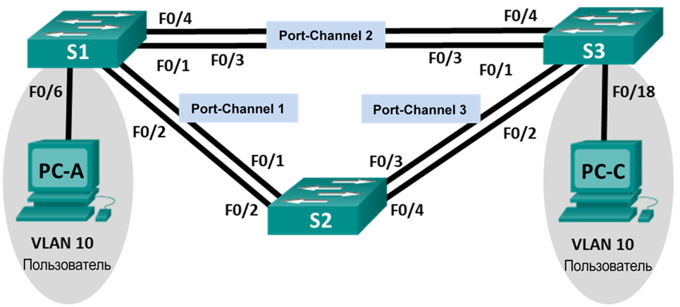

## Laboratory work. Troubleshooting EtherChannel

### Topology




### Addressing table

| Device | Interface |  IP-address  |     Mask      |
| :----: | :-------: | :----------: | :-----------: |
|   S1   |  VLAN 99  | 192.168.1.11 | 255.255.255.0 |
|   S2   |  VLAN 99  | 192.168.1.12 | 255.255.255.0 |
|   S3   |  VLAN 99  | 192.168.1.13 | 255.255.255.0 |
|  PC-A  |    NIC    | 192.168.0.2  | 255.255.255.0 |
|  PC-C  |    NIC    | 192.168.0.3  | 255.255.255.0 |

### VLAN assignments

| VLAN |    Name    |
| :--: | :--------: |
|  10  |   Users    |
|  99  | Management |


### Tasks

- Building a network and device settings
- Troubleshooting EtherChannel

### Building a network and device settings

Starting configuration before troubleshooting:

<details>
<summary>S1</summary>
<pre><code>
enable
conf t
hostname S1
interface range f0/1-24, g0/1-2
shutdown
exit
enable secret class
no ip domain lookup
line vty 0 15
password cisco
login
line con 0
 exec-t 0 0
 password cisco
 logging synchronous
 login
 exit
vlan 10
 name User
vlan 99
 Name Management
interface range f0/1-2
 switchport mode trunk
 channel-group 1 mode active
 switchport trunk native vlan 99
 no shutdown
interface range f0/3-4
 channel-group 2 mode desirable
 switchport trunk native vlan 99
 no shutdown
interface f0/6
 switchport mode access
 switchport access vlan 10
 no shutdown
interface vlan 99
 ip address 192.168.1.11 255.255.255.0
interface port-channel 1
 switchport trunk native vlan 99
 switchport mode trunk
interface port-channel 2
 switchport trunk native vlan 99
 switchport mode access
do wr
</code></pre>
</details>
<details>
<summary>S2</summary>
<pre><code>
enable
conf t
hostname S2
interface range f0/1-24, g0/1-2
 shutdown
 exit
enable secret class
no ip domain lookup
line vty 0 15
 password cisco
 login
line con 0
 exec-t 0 0
 password cisco
 logging synchronous
 login
 exit
vlan 10
 name User
vlan 99
 name Management
spanning-tree vlan 1,10,99 root primary
interface range f0/1-2
 switchport mode trunk
 channel-group 1 mode desirable
 switchport trunk native vlan 99
 no shutdown
interface range f0/3-4
 switchport mode trunk
 channel-group 3 mode desirable
 switchport trunk native vlan 99
interface vlan 99
 ip address 192.168.1.12 255.255.255.0
interface port-channel 1
 switchport trunk native vlan 99
 switchport trunk allowed vlan 1,99
interface port-channel 3
 switchport trunk native vlan 99
 switchport trunk allowed vlan 1,10,99
 switchport mode trunk
do wr
</code></pre>
</details>
<details>
<summary>S3</summary>
<pre><code>
enab
conf t
hostname S3
interface range f0/1-24, g0/1-2
 shutdown
 exit
enable secret class
no ip domain lookup
line vty 0 15
 password cisco
 login
line con 0
 exec-t 0 0
 password cisco
 logging synchronous
 login
 exit
vlan 10
 name User
vlan 99
 name Management
interface range f0/1-2
interface range f0/3-4
 switchport mode trunk
 channel-group 3 mode desirable
 switchport trunk native vlan 99
 no shutdown
interface f0/18
 switchport mode access
 switchport access vlan 10
 no shutdown
interface vlan 99
 ip address 192.168.1.13 255.255.255.0
interface port-channel 3
 switchport trunk native vlan 99
 switchport mode trunk
do wr
</code></pre>
</details>

### Troubleshooting EtherChannel

Stages of Diagnostic 

- Check Etherchannel summary
- Check VLANs: status, ports, configuration, mismatching;
- Make sure that Access VLAN 10 set up right
- Check STP

```
do sh etherchannel summary
```

<details>
<summary>S1</summary>
<pre><code>
S1(config)#do sh etherchannel summary
Flags:  D - down        P - in port-channel
        I - stand-alone s - suspended
        H - Hot-standby (LACP only)
        R - Layer3      S - Layer2
        U - in use      f - failed to allocate aggregator
        u - unsuitable for bundling
        w - waiting to be aggregated
        d - default port
!
!
Number of channel-groups in use: 2
Number of aggregators:           2
!
Group  Port-channel  Protocol    Ports
------+-------------+-----------+----------------------------------------------
!
1      Po1(SD)           LACP   Fa0/1(I) Fa0/2(I) 
2      Po2(SU)           PAgP   Fa0/3(P) Fa0/4(P) 
</code></pre>
</details>
<details>
<summary>S2</summary>
<pre><code>
S2(config-if)#do sh etherchannel summary
Flags:  D - down        P - in port-channel
        I - stand-alone s - suspended
        H - Hot-standby (LACP only)
        R - Layer3      S - Layer2
        U - in use      f - failed to allocate aggregator
        u - unsuitable for bundling
        w - waiting to be aggregated
        d - default port
!
!
Number of channel-groups in use: 2
Number of aggregators:           2
!
Group  Port-channel  Protocol    Ports
------+-------------+-----------+----------------------------------------------
!
1      Po1(SD)           PAgP   Fa0/1(I) Fa0/2(I) 
3      Po3(SD)           PAgP   Fa0/3(D) Fa0/4(D) 
</code></pre>
</details>
<details>
<summary>S3</summary>
<pre><code>
S3(config-if)#do sh etherchannel summary
Flags:  D - down        P - in port-channel
        I - stand-alone s - suspended
        H - Hot-standby (LACP only)
        R - Layer3      S - Layer2
        U - in use      f - failed to allocate aggregator
        u - unsuitable for bundling
        w - waiting to be aggregated
        d - default port
!
!
Number of channel-groups in use: 1
Number of aggregators:           1
!
Group  Port-channel  Protocol    Ports
------+-------------+-----------+----------------------------------------------
!
3      Po3(SU)           PAgP   Fa0/3(P) Fa0/4(P) 
</code></pre>
</details>
Conclusion 1:

For Switch 3 the Etherchannel 2 is missing; <u>let's fix it!</u>

```
S3(config)#int r fa0/3-4
S3(config-if-range)#channel-group 2 mode auto
```

Check VLANs: Access 10 and Trunk 99.

```
S1(config)#do show vlan brief

VLAN Name                             Status    Ports
---- -------------------------------- --------- -------------------------------
1    default                          active    Po1, Po2, Fa0/3, Fa0/4
                                                Fa0/5, Fa0/7, Fa0/8, Fa0/9
                                                Fa0/10, Fa0/11, Fa0/12, Fa0/13
                                                Fa0/14, Fa0/15, Fa0/16, Fa0/17
                                                Fa0/18, Fa0/19, Fa0/20, Fa0/21
                                                Fa0/22, Fa0/23, Fa0/24, Gig0/1
                                                Gig0/2
10   User                             active    Fa0/6
99   Management                       active    
1002 fddi-default                     active    
1003 token-ring-default               active    
1004 fddinet-default                  active    
1005 trnet-default                    active    
```

```
S3(config-if-range)#do show vlan brief

VLAN Name                             Status    Ports
---- -------------------------------- --------- -------------------------------
1    default                          active    Po3, Fa0/1, Fa0/2, Fa0/5
                                                Fa0/6, Fa0/7, Fa0/8, Fa0/9
                                                Fa0/10, Fa0/11, Fa0/12, Fa0/13
                                                Fa0/14, Fa0/15, Fa0/16, Fa0/17
                                                Fa0/19, Fa0/20, Fa0/21, Fa0/22
                                                Fa0/23, Fa0/24, Gig0/1, Gig0/2
10   User                             active    Fa0/18
99   Management                       active    
1002 fddi-default                     active    
1003 token-ring-default               active    
1004 fddinet-default                  active    
1005 trnet-default                    active    
```

Ok - moving forward

Status Po2 on SW1 and SW3

```
show running-config | section Port-channel2
```

```
S1#show running-config | section Port-channel2
interface Port-channel2
 switchport trunk native vlan 99
 switchport mode access
```

```
S3(config)#do show running-config | section Port-channel2
interface Port-channel2
 switchport trunk native vlan 99
 switchport mode trunk
```

Aggregation channel doesn't work with **access mode**; Change it!

```
S1(config)#interface Port-channel2
S1(config-if)#switchport mode trunk
S1(config-if)#exit
```

Showing other Po1 and Po3

```
S1#show running-config
!
interface FastEthernet0/1
 switchport trunk native vlan 99
 switchport mode trunk
 channel-group 1 mode active
!
interface FastEthernet0/2
 switchport trunk native vlan 99
 switchport mode trunk
 channel-group 1 mode active
```

```
S2#show running-config 
!
interface FastEthernet0/1
 switchport trunk native vlan 99
 switchport trunk allowed vlan 1,99
 switchport mode trunk
 channel-group 1 mode desirable
!
interface FastEthernet0/2
 switchport trunk native vlan 99
 switchport trunk allowed vlan 1,99
 switchport mode trunk
 channel-group 1 mode desirable
```

From side S2 all traffic from VLAN 10 **don't allow**, only VLAN 1,99

```
S2:
int r fa0/1-2
switchport trunk allowed vlan add 10
exit
```

Fix it, go forward.

I suggest looking at the config of each port

```
S1#show running-config 
!
interface FastEthernet0/1
 switchport trunk native vlan 99
 switchport mode trunk
 channel-group 1 mode active
 !
interface FastEthernet0/2
 switchport trunk native vlan 99
 switchport mode trunk
 channel-group 1 mode active
!
interface FastEthernet0/3
 switchport trunk native vlan 99
 switchport mode trunk
 channel-group 2 mode desirable
!
S1#show running-config | section 0/4
interface FastEthernet0/4
 switchport trunk native vlan 99
 switchport mode trunk
 channel-group 2 mode desirable
```

```
S2#show running-config 
!
interface FastEthernet0/1
 switchport trunk native vlan 99
 switchport trunk allowed vlan 1,10,99
 switchport mode trunk
 channel-group 1 mode desirable
!
interface FastEthernet0/2
 switchport trunk native vlan 99
 switchport trunk allowed vlan 1,10,99
 switchport mode trunk
 channel-group 1 mode desirable
!
interface FastEthernet0/3
 switchport trunk native vlan 99
 switchport trunk allowed vlan 1,10,99
 switchport mode trunk
 channel-group 3 mode desirable
 shutdown
!
interface FastEthernet0/4
 switchport trunk native vlan 99
 switchport trunk allowed vlan 1,10,99
 switchport mode trunk
 channel-group 3 mode desirable
 shutdown
```

```
S3#show running-config
!
interface FastEthernet0/1
 shutdown
!
interface FastEthernet0/2
 shutdown
!
interface FastEthernet0/3
 switchport trunk native vlan 99
 switchport mode trunk
 channel-group 2 mode auto
S3#show running-config | section 0/4
interface FastEthernet0/4
 switchport trunk native vlan 99
 switchport mode trunk
 channel-group 2 mode auto
```

So, I notice that ports are shutdown 

```
S2(config)#int r FastEthernet0/3-4
S2(config-if-range)#no shut
!
%LINK-5-CHANGED: Interface FastEthernet0/3, changed state to down
!
%LINK-5-CHANGED: Interface FastEthernet0/4, changed state to down
S2(config-if-range)#exit
```

```
S3(config)#int r fa0/1-2
 no shut
 switchport trunk native vlan 99
 switchport mode trunk
 channel-group 3 mode auto
```

Great, everything OK!

Diagnostic

```
S1#show etherchannel summary 
Flags:  D - down        P - in port-channel
        I - stand-alone s - suspended
        H - Hot-standby (LACP only)
        R - Layer3      S - Layer2
        U - in use      f - failed to allocate aggregator
        u - unsuitable for bundling
        w - waiting to be aggregated
        d - default port
!
!
Number of channel-groups in use: 2
Number of aggregators:           2
!
Group  Port-channel  Protocol    Ports
------+-------------+-----------+----------------------------------------------
!
1      Po1(SD)           LACP   Fa0/1(I) Fa0/2(I) 
2      Po2(SU)           PAgP   Fa0/3(P) Fa0/4(P) 
!
!
!
S2#show etherchannel summary 
Flags:  D - down        P - in port-channel
        I - stand-alone s - suspended
        H - Hot-standby (LACP only)
        R - Layer3      S - Layer2
        U - in use      f - failed to allocate aggregator
        u - unsuitable for bundling
        w - waiting to be aggregated
        d - default port
!
!
Number of channel-groups in use: 2
Number of aggregators:           2
!
Group  Port-channel  Protocol    Ports
------+-------------+-----------+----------------------------------------------
!
1      Po1(SD)           PAgP   Fa0/1(I) Fa0/2(I) 
3      Po3(SU)           PAgP   Fa0/3(P) Fa0/4(P) 
```

Again, mismatching protocols

I am choosing LACP for interface Po1 to SW2

```
S2(config)#no int po1
int r fa0/1-2
 no shut
 channel-group 1 mode passive
 exit
Int po 1
 switchport trunk native vlan 99
 switchport trunk allowed vlan 1,10,99
 switchport mode trunk
end
```

Checking again:

```
S1#show etherchannel summary 
Flags:  D - down        P - in port-channel
        I - stand-alone s - suspended
        H - Hot-standby (LACP only)
        R - Layer3      S - Layer2
        U - in use      f - failed to allocate aggregator
        u - unsuitable for bundling
        w - waiting to be aggregated
        d - default port


Number of channel-groups in use: 2
Number of aggregators:           2

Group  Port-channel  Protocol    Ports
------+-------------+-----------+----------------------------------------------

1      Po1(SU)           LACP   Fa0/1(P) Fa0/2(P) 
2      Po2(SU)           PAgP   Fa0/3(P) Fa0/4(P) 
!
S2#show etherchannel summary 
Flags:  D - down        P - in port-channel
        I - stand-alone s - suspended
        H - Hot-standby (LACP only)
        R - Layer3      S - Layer2
        U - in use      f - failed to allocate aggregator
        u - unsuitable for bundling
        w - waiting to be aggregated
        d - default port


Number of channel-groups in use: 2
Number of aggregators:           2

Group  Port-channel  Protocol    Ports
------+-------------+-----------+----------------------------------------------

1      Po1(SU)           LACP   Fa0/1(P) Fa0/2(P) 
3      Po3(SU)           PAgP   Fa0/3(P) Fa0/4(P) 
!
S3#show etherchannel summary 
Flags:  D - down        P - in port-channel
        I - stand-alone s - suspended
        H - Hot-standby (LACP only)
        R - Layer3      S - Layer2
        U - in use      f - failed to allocate aggregator
        u - unsuitable for bundling
        w - waiting to be aggregated
        d - default port


Number of channel-groups in use: 2
Number of aggregators:           2

Group  Port-channel  Protocol    Ports
------+-------------+-----------+----------------------------------------------

2      Po2(SU)           PAgP   Fa0/3(P) Fa0/4(P) 
3      Po3(SU)           PAgP   Fa0/1(P) Fa0/2(P) 
```

Checking ping:

```
ping 192.168.0.3

Pinging 192.168.0.3 with 32 bytes of data:

Request timed out.
Reply from 192.168.0.3: bytes=32 time=10ms TTL=128
Reply from 192.168.0.3: bytes=32 time=1ms TTL=128
Reply from 192.168.0.3: bytes=32 time=1ms TTL=128

Ping statistics for 192.168.0.3:
    Packets: Sent = 4, Received = 3, Lost = 1 (25% loss),
Approximate round trip times in milli-seconds:
    Minimum = 1ms, Maximum = 10ms, Average = 4ms
```

Done!
