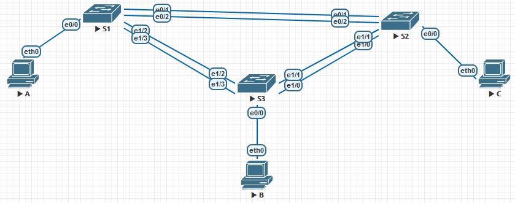

## Лабораторная работа. Настройка EtherChannel 

### Топология



### Таблица адресации

| Устройство | Интерфейс | IP-адрес      | Маска подсети |
| ---------- | --------- | ------------- | ------------- |
| S1         | VLAN 99   | 192.168.99.11 | 255.255.255.0 |
| S2         | VLAN 99   | 192.168.99.12 | 255.255.255.0 |
| S3         | VLAN 99   | 192.168.99.13 | 255.255.255.0 |
| PC-A       | NIC       | 192.168.10.1  | 255.255.255.0 |
| PC-B       | NIC       | 192.168.10.2  | 255.255.255.0 |
| PC-C       | NIC       | 192.168.10.3  | 255.255.255.0 |

### Цели

**Часть 1. Настройка базовых параметров коммутатора**
**Часть 2. Настройка PAgP**
**Часть 3. Настройка LACP**

### Настройка базовых параметров коммутатора

Для начало настроим имя устройства:

<details>
<summary>S1</summary>
<pre><code>
enable
conf t
hos S1
</code></pre>
</details>
<details>
<summary>S2</summary>
<pre><code>
enable
conf t
hos S2
</code></pre>
</details>
<details>
<summary>S3</summary>
<pre><code>
enable
conf t
hos S3
</code></pre>
</details>
Зададим IP адресацию для устройств согласно условию:

<details>
<summary>S1,S2,S3</summary>
<pre><code>
int vla 99
S1: ip addr 192.168.99.11 255.255.255.0
S2: ip addr 192.168.99.12 255.255.255.0
S3: ip addr 192.168.99.13 255.255.255.0
no shut
exit 
</code></pre>
</details>
Отключим поиск DNS , зашифруем пароли ,а также назначим баннерное сообщение:

<details>
<summary>S1,S2,S3</summary>
<pre><code>
no ip domain-loo
service password-encryption
Banner motd "This is a secure system. Authorized Access Only!" 
</code></pre>
</details>
Зададим пароль на привилегированный режим , консольный режим и на VTY ,а также сервис по синхронной регистрации.
<details>
<summary>S1,S2,S3</summary>
<pre><code>
enable secret class
line vty 0 4
logging synchronous
password cisco
login
exit
line con 0
logging synchronous
password cisco
login
exit 
</code></pre>
</details>
Отключим все порты на устройстве, кроме тех,что смотрят в сторону ПК
<details>
<summary>S1,S2,S3</summary>
<pre><code>
int ran e0/1-3
shut
int ran e1/0-3
shut 
exit
</code></pre>
</details>

создадим VLAN 99 , 10 именем **Management** и **Staff** соответственно
<details>
<summary>S1,S2,S3</summary>
<pre><code>
vlan 99
name Management
vlan 10
name Staff 
exit
</code></pre>
</details>
<<<<<<< Updated upstream
=======

>>>>>>> Stashed changes
Настроим порты коммутатора с присоединёнными узлами в качестве портов доступа в сети VLAN 10:
<details>
<summary>S1,S2,S3</summary>
<pre><code>
int e0/0
sw m ac
sw ac vl 10
exit
</code></pre>
</details>

Сохраним конфигурацию:
```
do copy run start
[Enter] 
```
Пропишем на ПК:

<details>
<summary>A</summary>
<pre><code>
ip 192.168.10.1/24
save

</code></pre>
</details>
<details>
<summary>B</summary>
<pre><code>
ip 192.168.10.2/24
save

</code></pre>
</details>
<details>
<summary>C</summary>
<pre><code>
ip 192.168.10.3/24
save

</code></pre>
</details>

### Настройка протокола PAgP

Настроим для S1 и S3 PAgP :

<details>
<summary>S1</summary>
<pre><code>
int ran e1/2-3
channel-group 1 mode desirable
no shut 
</code></pre>
</details>
<details>
<summary>S3</summary>
<pre><code>
int ran e1/2-3
channel-group 1 mode auto
no shut 
</code></pre>
</details>
