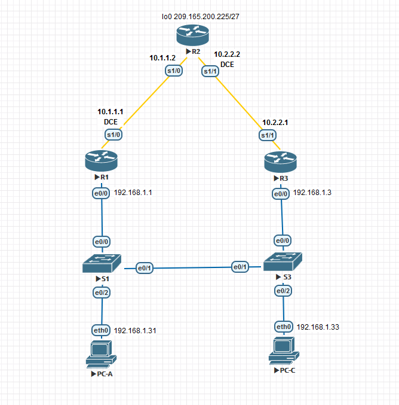

## Laboratory work. Setting up HSRP

### Topology



### Addressing table

| Device | Interface    | IP address      | Subnet Mask     | Gateway     |
| ------ | ------------ | --------------- | --------------- | ----------- |
| R1     | G0/1         | 192.168.1.1     | 255.255.255.0   | —           |
|        | S0/0/0 (DCE) | 10.1.1.1        | 255.255.255.252 | —           |
| R2     | S0/0/0       | 10.1.1.2        | 255.255.255.252 | —           |
|        | S0/0/1 (DCE) | 10.2.2.2        | 255.255.255.252 | —           |
|        | Lo1          | 209.165.200.225 | 255.255.255.224 | —           |
| R3     | G0/1         | 192.168.1.3     | 255.255.255.0   | —           |
|        | S0/0/1       | 10.2.2.1        | 255.255.255.252 | —           |
| R1     | VLAN 1       | 192.168.1.11    | 255.255.255.0   | 192.168.1.1 |
| R3     | VLAN 1       | 192.168.1.13    | 255.255.255.0   | 192.168.1.3 |
| PC-A   | NIC          | 192.168.1.31    | 255.255.255.0   | 192.168.1.1 |
| PC-C   | NIC          | 192.168.1.33    | 255.255.255.0   | 192.168.1.3 |

### Goals

Part 1. Building a network and checking the connection
Part 2. Configuring redundancy on the first hop using HSRP

### Configuring basic Switch parameters

To begin with, configure the device name:

<details>
<summary>R1</summary>
<pre><code>
Enable
Configure terminal
!
no ip domain-lookup
hos R1
</code></pre>
</details>
<details>
<summary>R2</summary>
<pre><code>
Enable
Configure terminal
!
no ip domain-lookup
hos R2
</code></pre>
</details>
<details>
<summary>R3</summary>
<pre><code>
Enable
Configure terminal
!
no ip domain-lookup
hos R3
</code></pre>
</details>

We will set the IP addressing for the devices according to the condition:

<details>
<summary>R1</summary>
<pre><code>
interface Serial1/1
ip address 10.2.2.1 255.255.255.252
no shut
!
interface Ethernet0/0
ip address 192.168.1.3 255.255.255.0
standby 1 ip 192.168.1.254
standby version 2
duplex full
no shut
</code></pre>
</details>
<details>
<summary>R2</summary>
<pre><code>
interface Serial1/0
ip address 10.1.1.2 255.255.255.252
no shut
!
interface Serial1/1
ip address 10.2.2.2 255.255.255.0
clock rate 128000
no shut
!
int lo0
ip address 209.165.200.225 255.255.255.224
exit
</code></pre>
</details>
<details>
<summary>R3</summary>
<pre><code>
interface Serial1/1
ip address 10.2.2.1 255.255.255.252
no shut
!
interface Ethernet0/0
ip address 192.168.1.3 255.255.255.0
standby 1 ip 192.168.1.254
standby version 2
duplex full
no shut
</code></pre>
</details>
<details>
<summary>R3</summary>
<pre><code>
interface Serial1/1
ip address 10.2.2.1 255.255.255.252
no shut
!
interface Ethernet0/0
ip address 192.168.1.3 255.255.255.0
standby 1 ip 192.168.1.254
standby version 2
duplex full
no shut
</code></pre>
</details>
<details>
<summary>PC-A</summary>
<pre><code>
set pcname PC-A
ip 192.168.1.31 192.168.1.254 24
</code></pre>
</details>
<details>
<summary>PC-C</summary>
<pre><code>
set pcname PC-C
ip 192.168.1.33 192.168.1.254 24
</code></pre>
</details>


Disable DNS lookup , encrypt passwords , and assign a banner message:

<details>
<summary>R1,R2,R3</summary>
<pre><code>
no ip domain-loo
service password-encryption
Banner motd "This is a secure system. Authorized Access Only!" 
</code></pre>
</details>

We will set a password for privileged mode, console mode and VTY, as well as a service for synchronous registration.

<details>
<summary>R1,R2,R3</summary>
<pre><code>
enable secret class
line vty 0 4
logging synchronous
password cisco
login
exit
line con 0
exec-timeout 0 0
logging synchronous
password cisco
login
exit 
</code></pre>
</details>

Configuring the OSPF protocol to provide Internet access

<details>
<summary>R1</summary>
<pre><code>
router ospf 1
router-id 1.1.1.1
network 10.1.1.0 0.0.0.3 area 0
network 192.168.1.0 0.0.0.255 area 0
exit
</code></pre>
</details>
<details>
<summary>R2</summary>
<pre><code>
router ospf 1
 router-id 2.2.2.2
 network 10.1.1.0 0.0.0.3 area 0
 network 10.2.2.0 0.0.0.3 area 0
 default-information originate
ip route 0.0.0.0 0.0.0.0 lo0
exit
</code></pre>
</details>
<details>
<summary>R3</summary>
<pre><code>
router ospf 1
router-id 3.3.3.3
network 10.2.2.0 0.0.0.3 area 0
network 192.168.1.0 0.0.0.255 area 0
exit
</code></pre>
</details>

Save the configuration:

<details>
<summary>R1,R2,R3</summary>
<pre><code>
do copy run start
[Enter]
</code></pre>
</details>

Check the connection between PC and Routers.

<details>
<summary>R1</summary>
<pre><code>
R1#show ip route
Codes: L - local, C - connected, S - static, R - RIP, M - mobile, B - BGP
       D - EIGRP, EX - EIGRP external, O - OSPF, IA - OSPF inter area
       N1 - OSPF NSSA external type 1, N2 - OSPF NSSA external type 2
       E1 - OSPF external type 1, E2 - OSPF external type 2
       i - IS-IS, su - IS-IS summary, L1 - IS-IS level-1, L2 - IS-IS level-2
       ia - IS-IS inter area, * - candidate default, U - per-user static route
       o - ODR, P - periodic downloaded static route, H - NHRP, l - LISP
       a - application route
       + - replicated route, % - next hop override
!
Gateway of last resort is 10.1.1.2 to network 0.0.0.0
!
O*E2  0.0.0.0/0 [110/1] via 10.1.1.2, 00:05:12, Serial1/0
      10.0.0.0/8 is variably subnetted, 4 subnets, 3 masks
C        10.1.1.0/30 is directly connected, Serial1/0
L        10.1.1.1/32 is directly connected, Serial1/0
O        10.2.2.0/24 [110/128] via 10.1.1.2, 00:05:12, Serial1/0
O        10.2.2.0/30 [110/74] via 192.168.1.3, 00:04:27, Ethernet0/0
      192.168.1.0/24 is variably subnetted, 2 subnets, 2 masks
C        192.168.1.0/24 is directly connected, Ethernet0/0
L        192.168.1.1/32 is directly connected, Ethernet0/0
</code></pre>
</details>
<details>
<summary>R2</summary>
<pre><code>
Codes: L - local, C - connected, S - static, R - RIP, M - mobile, B - BGP
       D - EIGRP, EX - EIGRP external, O - OSPF, IA - OSPF inter area
       N1 - OSPF NSSA external type 1, N2 - OSPF NSSA external type 2
       E1 - OSPF external type 1, E2 - OSPF external type 2
       i - IS-IS, su - IS-IS summary, L1 - IS-IS level-1, L2 - IS-IS level-2
       ia - IS-IS inter area, * - candidate default, U - per-user static route
       o - ODR, P - periodic downloaded static route, H - NHRP, l - LISP
       a - application route
       + - replicated route, % - next hop override
!
Gateway of last resort is 0.0.0.0 to network 0.0.0.0
!
S*    0.0.0.0/0 is directly connected, Loopback0
      10.0.0.0/8 is variably subnetted, 5 subnets, 3 masks
C        10.1.1.0/30 is directly connected, Serial1/0
L        10.1.1.2/32 is directly connected, Serial1/0
C        10.2.2.0/24 is directly connected, Serial1/1
O        10.2.2.0/30 [110/128] via 10.2.2.1, 00:06:30, Serial1/1
L        10.2.2.2/32 is directly connected, Serial1/1
O     192.168.1.0/24 [110/74] via 10.2.2.1, 00:06:30, Serial1/1
                     [110/74] via 10.1.1.1, 00:05:44, Serial1/0
      209.165.200.0/24 is variably subnetted, 2 subnets, 2 masks
C        209.165.200.224/27 is directly connected, Loopback0
L        209.165.200.225/32 is directly connected, Loopback0
</code></pre>
</details>
<details>
<summary>R3</summary>
<pre><code>
Codes: L - local, C - connected, S - static, R - RIP, M - mobile, B - BGP
       D - EIGRP, EX - EIGRP external, O - OSPF, IA - OSPF inter area
       N1 - OSPF NSSA external type 1, N2 - OSPF NSSA external type 2
       E1 - OSPF external type 1, E2 - OSPF external type 2
       i - IS-IS, su - IS-IS summary, L1 - IS-IS level-1, L2 - IS-IS level-2
       ia - IS-IS inter area, * - candidate default, U - per-user static route
       o - ODR, P - periodic downloaded static route, H - NHRP, l - LISP
       a - application route
       + - replicated route, % - next hop override
!
Gateway of last resort is 10.2.2.2 to network 0.0.0.0
!
O*E2  0.0.0.0/0 [110/1] via 10.2.2.2, 00:07:43, Serial1/1
      10.0.0.0/8 is variably subnetted, 4 subnets, 3 masks
O        10.1.1.0/30 [110/74] via 192.168.1.1, 00:07:07, Ethernet0/0
O        10.2.2.0/24 [110/128] via 10.2.2.2, 00:07:43, Serial1/1
C        10.2.2.0/30 is directly connected, Serial1/1
L        10.2.2.1/32 is directly connected, Serial1/1
      192.168.1.0/24 is variably subnetted, 2 subnets, 2 masks
C        192.168.1.0/24 is directly connected, Ethernet0/0
L        192.168.1.3/32 is directly connected, Ethernet0/0
</code></pre>
</details>
<details>
<summary>PC-A</summary>
<pre><code>
PC-A> ping 192.168.1.1
!
84 bytes from 192.168.1.1 icmp_seq=1 ttl=255 time=0.772 ms
84 bytes from 192.168.1.1 icmp_seq=2 ttl=255 time=1.706 ms
84 bytes from 192.168.1.1 icmp_seq=3 ttl=255 time=1.747 ms
84 bytes from 192.168.1.1 icmp_seq=4 ttl=255 time=1.742 ms
84 bytes from 192.168.1.1 icmp_seq=5 ttl=255 time=1.694 ms
!
PC-A> ping 192.168.1.3
!
84 bytes from 192.168.1.3 icmp_seq=1 ttl=255 time=1.550 ms
84 bytes from 192.168.1.3 icmp_seq=2 ttl=255 time=4.235 ms
84 bytes from 192.168.1.3 icmp_seq=3 ttl=255 time=2.630 ms
84 bytes from 192.168.1.3 icmp_seq=4 ttl=255 time=2.568 ms
84 bytes from 192.168.1.3 icmp_seq=5 ttl=255 time=3.130 ms
!
PC-A> ping 192.168.1.33
!
84 bytes from 192.168.1.33 icmp_seq=1 ttl=64 time=2.700 ms
84 bytes from 192.168.1.33 icmp_seq=2 ttl=64 time=2.368 ms
84 bytes from 192.168.1.33 icmp_seq=3 ttl=64 time=2.496 ms
84 bytes from 192.168.1.33 icmp_seq=4 ttl=64 time=2.359 ms
84 bytes from 192.168.1.33 icmp_seq=5 ttl=64 time=2.583 ms
</code></pre>
</details>
<details>
<summary>PC-C</summary>
<pre><code>
PC-C> ping 192.168.1.1
!
84 bytes from 192.168.1.1 icmp_seq=1 ttl=255 time=2.225 ms
84 bytes from 192.168.1.1 icmp_seq=2 ttl=255 time=2.611 ms
84 bytes from 192.168.1.1 icmp_seq=3 ttl=255 time=2.487 ms
84 bytes from 192.168.1.1 icmp_seq=4 ttl=255 time=1.620 ms
84 bytes from 192.168.1.1 icmp_seq=5 ttl=255 time=2.675 ms
!
PC-C> ping 192.168.1.3
!
84 bytes from 192.168.1.3 icmp_seq=1 ttl=255 time=1.523 ms
84 bytes from 192.168.1.3 icmp_seq=2 ttl=255 time=1.799 ms
84 bytes from 192.168.1.3 icmp_seq=3 ttl=255 time=2.031 ms
84 bytes from 192.168.1.3 icmp_seq=4 ttl=255 time=2.702 ms
84 bytes from 192.168.1.3 icmp_seq=5 ttl=255 time=1.040 ms
!
PC-C> ping 192.168.1.31
!
84 bytes from 192.168.1.31 icmp_seq=1 ttl=64 time=2.325 ms
84 bytes from 192.168.1.31 icmp_seq=2 ttl=64 time=2.563 ms
84 bytes from 192.168.1.31 icmp_seq=3 ttl=64 time=2.485 ms
84 bytes from 192.168.1.31 icmp_seq=4 ttl=64 time=2.396 ms
84 bytes from 192.168.1.31 icmp_seq=5 ttl=64 time=2.166 ms
</code></pre>
</details>

Determine the Internet traffic path for PC-A and PC-C:

<details>
<summary>PC-A</summary>
<pre><code>
PC-A> trace 209.165.200.225
trace to 209.165.200.225, 8 hops max, press Ctrl+C to stop
 1   192.168.1.1   1.555 ms  1.954 ms  3.504 ms
 2   *10.1.1.2   10.647 ms (ICMP type:3, code:3, Destination port unreachable)  *
</code></pre>
</details>

### Configuring redundancy on the first hop using HSRP

In this step, you will configure HSRP and change the default gateway address on PC-A, PC-C to a virtual IP address as gateway for HSRP. R1 is assigned by the active router using the HSRP priority command.

Configure the HSRP protocol on the R1 router.

<details>
<summary>R1</summary>
<pre><code>
interface Ethernet0/0
standby 1 ip 192.168.1.254
standby version 2
standby 1 priority 150
standby 1 preempt
exit
</code></pre>
</details>

Configure the HSRP protocol on the R3 router.

<details>
<summary>R3</summary>
<pre><code>
interface Ethernet0/0
standby 1 ip 192.168.1.254
standby version 2
exit
</code></pre>
</details>

Check the HSRP by running the show standby command on R1 and R3.

<details>
<summary>R1</summary>
<pre><code>
R1#show standby
Ethernet0/0 - Group 1 (version 2)
  State is Active
    7 state changes, last state change 00:12:01
  Virtual IP address is 192.168.1.254
  Active virtual MAC address is 0000.0c9f.f001
    Local virtual MAC address is 0000.0c9f.f001 (v2 default)
  Hello time 3 sec, hold time 10 sec
    Next hello sent in 1.264 secs
  Preemption enabled
  Active router is local
  Standby router is unknown
  Priority 150 (configured 150)
  Group name is "hsrp-Et0/0-1" (default)
</code></pre>
</details>
<details>
<summary>R3</summary>
<pre><code>
R3#show standby
Ethernet0/0 - Group 1 (version 2)
  State is Init (interface down)
    6 state changes, last state change 00:13:00
  Virtual IP address is 192.168.1.254
  Active virtual MAC address is unknown
    Local virtual MAC address is 0000.0c9f.f001 (v2 default)
  Hello time 3 sec, hold time 10 sec
  Preemption disabled
  Active router is unknown
  Standby router is unknown
  Priority 100 (default 100)
  Group name is "hsrp-Et0/0-1" (default)
</code></pre>
</details>

Which router is active?

	R1 is an active router

Which MAC address is used for the virtual IP address?

	The MAC address 0000.0C9F.F001 is used for the virtual IP address

What IP address and priority are used for the backup router?

	Priority 100

Use the **show standby brief** command on R1 and R3 to view the HSRP status summary.

<details>
<summary>R1</summary>
<pre><code>
R1#show standby brief
                     P indicates configured to preempt.
                     |
Interface   Grp  Pri P State   Active          Standby         Virtual IP
Et0/0       1    150 P Active  local           unknown         192.168.1.254
</code></pre>
</details>
<details>
<summary>R3</summary>
<pre><code>
R3#show standby brief
                     P indicates configured to preempt.
                     |
Interface   Grp  Pri P State   Active          Standby         Virtual IP
Et0/0       1    100   Standby 192.168.1.1     local           192.168.1.254
</code></pre>
</details>

Change the default gateway address for PC-A, PC-C, S1 and S3. Which address should I use?

	192.168.1.254

Check the new settings. Send an echo request from PC-A and PC-C to the loopback address of router R2. Have the echo requests been completed successfully?

<details>
<summary>PC-A</summary>
<pre><code>
PC-A> ping 209.165.200.225
!
84 bytes from 209.165.200.225 icmp_seq=1 ttl=254 time=19.836 ms
84 bytes from 209.165.200.225 icmp_seq=2 ttl=254 time=10.201 ms
84 bytes from 209.165.200.225 icmp_seq=3 ttl=254 time=11.864 ms
84 bytes from 209.165.200.225 icmp_seq=4 ttl=254 time=11.760 ms
84 bytes from 209.165.200.225 icmp_seq=5 ttl=254 time=12.061 ms
</code></pre>
</details>
<details>
<summary>PC-C</summary>
<pre><code>
PC-C>  ping 209.165.200.225
!
84 bytes from 209.165.200.225 icmp_seq=1 ttl=254 time=13.537 ms
84 bytes from 209.165.200.225 icmp_seq=2 ttl=254 time=12.074 ms
84 bytes from 209.165.200.225 icmp_seq=3 ttl=254 time=12.651 ms
84 bytes from 209.165.200.225 icmp_seq=4 ttl=254 time=11.954 ms
84 bytes from 209.165.200.225 icmp_seq=5 ttl=254 time=12.367 ms
</code></pre>
</details>

Start an echo testing session on PC-A and disconnect from the switch connected to the active HSRP router (R1).

<details>
<summary>PC-A</summary>
<pre><code>
PC-A> ping 209.165.200.225 -t
!
84 bytes from 209.165.200.225 icmp_seq=1 ttl=254 time=12.011 ms
84 bytes from 209.165.200.225 icmp_seq=2 ttl=254 time=12.801 ms
84 bytes from 209.165.200.225 icmp_seq=3 ttl=254 time=12.662 ms
84 bytes from 209.165.200.225 icmp_seq=4 ttl=254 time=11.491 ms
84 bytes from 209.165.200.225 icmp_seq=5 ttl=254 time=10.327 ms
84 bytes from 209.165.200.225 icmp_seq=6 ttl=254 time=10.984 ms
84 bytes from 209.165.200.225 icmp_seq=7 ttl=254 time=10.152 ms
84 bytes from 209.165.200.225 icmp_seq=8 ttl=254 time=12.642 ms
209.165.200.225 icmp_seq=9 timeout
209.165.200.225 icmp_seq=10 timeout
209.165.200.225 icmp_seq=11 timeout
209.165.200.225 icmp_seq=12 timeout
84 bytes from 209.165.200.225 icmp_seq=13 ttl=254 time=11.610 ms
84 bytes from 209.165.200.225 icmp_seq=14 ttl=254 time=12.028 ms
84 bytes from 209.165.200.225 icmp_seq=15 ttl=254 time=10.678 ms
84 bytes from 209.165.200.225 icmp_seq=16 ttl=254 time=10.117 ms
</code></pre>
</details>
Run the show standby brief command on routers R1 and R3. Which router is active? 

```
R1
```

Reconnect the cable connecting the switch and the router, or turn on the e0/0 interface. Which router is now active? Explain the answer.

```
R1 - since the priority is higher
```

Changing HSRP priorities.

Change the HSRP priority to 200 on the R3 router. Which router is active?

<details>
<summary>R3</summary>
<pre><code>
R3(config)#int e0/0
R3(config-if)#standby 1 priority 200
R3(config-if)#do sh stand brie
                     P indicates configured to preempt.
                     |
Interface   Grp  Pri P State   Active          Standby         Virtual IP
Et0/0       1    200   Standby 192.168.1.1     local           192.168.1.254
</code></pre>
</details>

```
 R1
```

Run the command to make the R3 router active without changing the priority. What command did you use?

```
R3(config-if)#standby 1 preempt
```

Use the show command to verify that R3 is the active router.

<details>
<summary>R3</summary>
<pre><code>
R3(config-if)#standby 1 preempt
*Nov  1 08:57:10.876: %HSRP-5-STATECHANGE: Ethernet0/0 Grp 1 state Standby -> Active
R3(config-if)#do sh stand brie
                     P indicates configured to preempt.
                     |
Interface   Grp  Pri P State   Active          Standby         Virtual IP
Et0/0       1    200 P Active  local           unknown         192.168.1.254
</code></pre>
</details>

<u>Questions to repeat</u>

Why might redundancy be required in a local network?

```
Ensuring trouble-free access to resources
```
