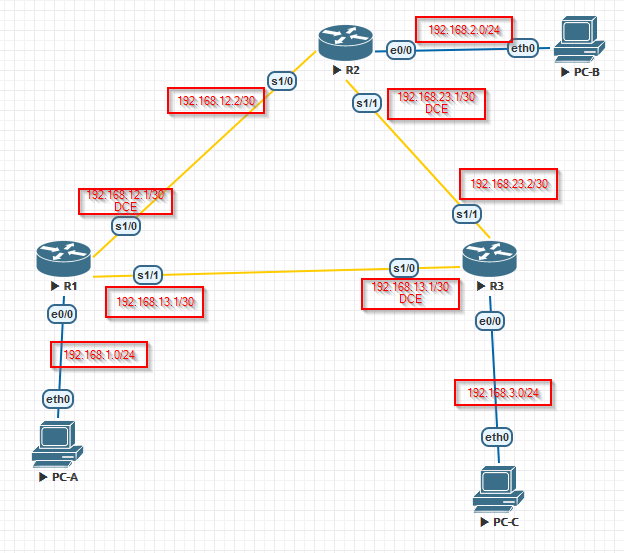

# Лабораторная работа. Настройка базового протокола OSPFv2 для одной области

## Топология



## Таблица адресации

| Устройство | Интерфейс    | IP-адрес     | Маска подсети   | Шлюз по умолчанию |
| ---------- | ------------ | ------------ | --------------- | ----------------- |
| R1         | G0/0         | 192.168.1.1  | 255.255.255.0   | —                 |
|            | S0/0/0 (DCE) | 192.168.12.1 | 255.255.255.252 | —                 |
|            | S0/0/1       | 192.168.13.1 | 255.255.255.252 | —                 |
| R2         | G0/0         | 192.168.2.1  | 255.255.255.0   | —                 |
|            | S0/0/0       | 192.168.12.2 | 255.255.255.252 | —                 |
|            | S0/0/1 (DCE) | 192.168.23.1 | 255.255.255.252 | —                 |
| R3         | G0/0         | 192.168.3.1  | 255.255.255.0   | —                 |
|            | S0/0/0 (DCE) | 192.168.13.2 | 255.255.255.252 | —                 |
|            | S0/0/1       | 192.168.23.2 | 255.255.255.252 | —                 |
| PC-A       | NIC          | 192.168.1.3  | 255.255.255.0   | 192.168.1.1       |
| PC-B       | NIC          | 192.168.2.3  | 255.255.255.0   | 192.168.2.1       |
| PC-C       | NIC          | 192.168.3.3  | 255.255.255.0   | 192.168.3.1       |

## Задачи

Часть 1. Создание сети и настройка основных параметров устройства

Часть 2. Настройка и проверка маршрутизации OSPF

Часть 3. Изменение назначений идентификаторов маршрутизаторов

Часть 4. Настройка пассивных интерфейсов OSPF

Часть 5. Изменение метрик OSPF


### Создание сети и настройка основных параметров устройства

<details>
<summary>R1</summary>
<pre><code>
Enable
Configure terminal
!
no ip domain-lookup
hos R1
!
enable secret class 
line vty 0 4 
logging synchronous 
password cisco 
login 
exit
!
line con 0
exec-t 0 0
logging synchronous 
password cisco 
login 
exit 
!
Banner motd "This is a secure system. Authorized Access Only!"
!
int e0/0
ip addr 192.168.1.1 255.255.255.0
no shut
exit
!
int se1/0
 clock rate 128000 
ip addr 192.168.12.1 255.255.255.252
no shut
exit
!
int se1/1
ip addr 192.168.13.1 255.255.255.252
no shut
exit
!
end
wr
</code></pre>
</details>
<details>
<summary>R2</summary>
<pre><code>
Enable
Configure terminal
!
hos R2
!
no ip domain-lookup
enable secret class 
!
line vty 0 4 
logging synchronous 
password cisco 
login 
exit
! 
line con 0 
exec-t 0 0
logging synchronous 
password cisco 
login 
exit 
!
Banner motd "This is a secure system. Authorized Access Only!"
!
int se1/0
ip addr 192.168.12.2 255.255.255.252
no shut
exit
!
int se1/1
 clock rate 128000 
ip addr 192.168.23.1 255.255.255.252
no shut
exit
!
int e 0/0
ip addr 192.168.2.1 255.255.255.0
no shut
exit
!
end
write
</code></pre>
</details>
<details>
<summary>R3</summary>
<pre><code>
Enable
Configure terminal
!
no ip domain-lookup
hos R3
!
enable secret class 
line vty 0 4 
logging synchronous 
password cisco 
login 
exit 
!
line con 0 
exec-t 0 0
logging synchronous 
password cisco 
login 
exit 
Banner motd "This is a secure system. Authorized Access Only!"
!
int se1/0
 clock rate 128000 
ip addr 192.168.13.2 255.255.255.252
no shut
exit
!
int se 1/1
ip addr 192.168.23.2 255.255.255.252
no shut
exit
!
int e0/0
ip addr 192.168.3.1 255.255.255.0
no shut
exit
!
do write
</code></pre>
</details>
<details>
<summary>PC-A</summary>
<pre><code>
set pcname PC-A
ip 192.168.1.3 24 192.168.1.1
</code></pre>
</details>
<details>
<summary>PC-B</summary>
<pre><code>
set pcname PC-B
ip 192.168.2.3 24 192.168.2.1
</code></pre>
</details>
<details>
<summary>PC-C</summary>
<pre><code>
set pcname PC-C
ip 192.168.3.3 24 192.168.3.1
</code></pre>
</details>


### Настройка и проверка маршрутизации OSPF

Настроим протокол OSPF на роутерах:

<details>
<summary>R1</summary>
<pre><code>
router ospf 1
network 192.168.1.0 0.0.0.255 area 0
network 192.168.12.0 0.0.0.3 area 0
network 192.168.13.0 0.0.0.3 area 0
</code></pre>
</details>
<details>
<summary>R2</summary>
<pre><code>
router ospf 1
network 192.168.2.0 0.0.0.255 area 0
network 192.168.12.0 0.0.0.3 area 0
network 192.168.23.0 0.0.0.3 area 0
</code></pre>
</details>
<details>
<summary>R3</summary>
<pre><code>
router ospf 1
network 192.168.3.0 0.0.0.255 area 0
network 192.168.13.0 0.0.0.3 area 0
network 192.168.23.0 0.0.0.3 area 0
</code></pre>
</details>

Проверим информацию о соседних устройствах и маршрутизации OSPF

```
show ip ospf neighbor
```

<details>
<summary>R1</summary>
<pre><code>
R1(config-router)#do show ip ospf neighbor
!
Neighbor ID     Pri   State           Dead Time   Address         Interface
192.168.23.2      0   FULL/  -        00:00:34    192.168.13.2    Serial1/1
192.168.23.1      0   FULL/  -        00:00:39    192.168.12.2    Serial1/0
</code></pre>
</details>
<details>
<summary>R2</summary>
<pre><code>
R2(config-router)#do show ip ospf neighbor
!
Neighbor ID     Pri   State           Dead Time   Address         Interface
192.168.23.2      0   FULL/  -        00:00:39    192.168.23.2    Serial1/1
192.168.13.1      0   FULL/  -        00:00:35    192.168.12.1    Serial1/0
</code></pre>
</details>
<details>
<summary>R3</summary>
<pre><code>
R3(config-router)#do show ip ospf neighbor
!
Neighbor ID     Pri   State           Dead Time   Address         Interface
192.168.23.1      0   FULL/  -        00:00:35    192.168.23.1    Serial1/1
192.168.13.1      0   FULL/  -        00:00:32    192.168.13.1    Serial1/0
</code></pre>
</details>


**show ip route**

<details>
<summary>R1</summary>
<pre><code>
R1#show ip route
Codes: L - local, C - connected, S - static, R - RIP, M - mobile, B - BGP
       D - EIGRP, EX - EIGRP external, O - OSPF, IA - OSPF inter area
       N1 - OSPF NSSA external type 1, N2 - OSPF NSSA external type 2
       E1 - OSPF external type 1, E2 - OSPF external type 2
       i - IS-IS, su - IS-IS summary, L1 - IS-IS level-1, L2 - IS-IS level-2
       ia - IS-IS inter area, * - candidate default, U - per-user static route
       o - ODR, P - periodic downloaded static route, H - NHRP, l - LISP
       a - application route
       + - replicated route, % - next hop override
!
Gateway of last resort is not set
!
      192.168.1.0/24 is variably subnetted, 2 subnets, 2 masks
C        192.168.1.0/24 is directly connected, Ethernet0/0
L        192.168.1.1/32 is directly connected, Ethernet0/0
O     192.168.2.0/24 [110/74] via 192.168.12.2, 00:05:51, Serial1/0
O     192.168.3.0/24 [110/74] via 192.168.13.2, 00:05:41, Serial1/1
      192.168.12.0/24 is variably subnetted, 2 subnets, 2 masks
C        192.168.12.0/30 is directly connected, Serial1/0
L        192.168.12.1/32 is directly connected, Serial1/0
      192.168.13.0/24 is variably subnetted, 2 subnets, 2 masks
C        192.168.13.0/30 is directly connected, Serial1/1
L        192.168.13.1/32 is directly connected, Serial1/1
      192.168.23.0/30 is subnetted, 1 subnets
O        192.168.23.0 [110/128] via 192.168.13.2, 00:05:31, Serial1/1
                      [110/128] via 192.168.12.2, 00:05:41, Serial1/0
</code></pre>
</details>
**show ip protocols** 

<details>
<summary>R1</summary>
<pre><code>
R1(config-router)#do show ip protocols
*** IP Routing is NSF aware ***
!
Routing Protocol is "application"
  Sending updates every 0 seconds
  Invalid after 0 seconds, hold down 0, flushed after 0
  Outgoing update filter list for all interfaces is not set
  Incoming update filter list for all interfaces is not set
  Maximum path: 32
  Routing for Networks:
  Routing Information Sources:
    Gateway         Distance      Last Update
  Distance: (default is 4)
!
Routing Protocol is "ospf 1"
  Outgoing update filter list for all interfaces is not set
  Incoming update filter list for all interfaces is not set
  Router ID 192.168.13.1
  Number of areas in this router is 1. 1 normal 0 stub 0 nssa
  Maximum path: 4
  Routing for Networks:
    192.168.1.0 0.0.0.255 area 0
    192.168.12.0 0.0.0.3 area 0
    192.168.13.0 0.0.0.3 area 0
  Routing Information Sources:
    Gateway         Distance      Last Update
    192.168.23.2         110      00:02:20
    192.168.23.1         110      00:02:30
  Distance: (default is 110)
</code></pre>
</details>

**show ip ospf**

<details>
<summary>R1</summary>
<pre><code>
R1(config-router)#do show ip ospf
 Routing Process "ospf 1" with ID 192.168.13.1
 Start time: 00:42:09.100, Time elapsed: 00:03:58.496
 Supports only single TOS(TOS0) routes
 Supports opaque LSA
 Supports Link-local Signaling (LLS)
 Supports area transit capability
 Supports NSSA (compatible with RFC 3101)
 Supports Database Exchange Summary List Optimization (RFC 5243)
 Event-log enabled, Maximum number of events: 1000, Mode: cyclic
 Router is not originating router-LSAs with maximum metric
 Initial SPF schedule delay 5000 msecs
 Minimum hold time between two consecutive SPFs 10000 msecs
 Maximum wait time between two consecutive SPFs 10000 msecs
 Incremental-SPF disabled
 Minimum LSA interval 5 secs
 Minimum LSA arrival 1000 msecs
 LSA group pacing timer 240 secs
 Interface flood pacing timer 33 msecs
 Retransmission pacing timer 66 msecs
 Number of external LSA 0. Checksum Sum 0x000000
 Number of opaque AS LSA 0. Checksum Sum 0x000000
 Number of DCbitless external and opaque AS LSA 0
 Number of DoNotAge external and opaque AS LSA 0
 Number of areas in this router is 1. 1 normal 0 stub 0 nssa
 Number of areas transit capable is 0
 External flood list length 0
 IETF NSF helper support enabled
 Cisco NSF helper support enabled
 Reference bandwidth unit is 100 mbps
    Area BACKBONE(0)
        Number of interfaces in this area is 3
        Area has no authentication
        SPF algorithm last executed 00:03:09.979 ago
        SPF algorithm executed 4 times
        Area ranges are
        Number of LSA 3. Checksum Sum 0x019D46
        Number of opaque link LSA 0. Checksum Sum 0x000000
        Number of DCbitless LSA 0
        Number of indication LSA 0
        Number of DoNotAge LSA 0
        Flood list length 0
</code></pre>
</details>

**show ip ospf interface brief** 

<details>
<summary>R1</summary>
<pre><code>
R1#show ip ospf interface brief
!
Interface    PID   Area            IP Address/Mask    Cost  State Nbrs F/C
Se1/1           1     0                   192.168.13.1/30      64      P2P   1/1
Se1/0           1     0                   192.168.12.1/30      64      P2P   1/1
Et0/0            1     0                   192.168.1.1/24        10      DR    0/0
</code></pre>
</details>

**Show ip ospf interface**

<details>
<summary>R1</summary>
<pre><code>
R1(config-router)#do Show ip ospf interface
Serial1/1 is up, line protocol is up
  Internet Address 192.168.13.1/30, Area 0, Attached via Network Statement
  Process ID 1, Router ID 192.168.13.1, Network Type POINT_TO_POINT, Cost: 64
  Topology-MTID    Cost    Disabled    Shutdown      Topology Name
        0           64        no          no            Base
  Transmit Delay is 1 sec, State POINT_TO_POINT
  Timer intervals configured, Hello 10, Dead 40, Wait 40, Retransmit 5
    oob-resync timeout 40
    Hello due in 00:00:08
  Supports Link-local Signaling (LLS)
  Cisco NSF helper support enabled
  IETF NSF helper support enabled
  Index 1/3/3, flood queue length 0
  Next 0x0(0)/0x0(0)/0x0(0)
  Last flood scan length is 1, maximum is 1
  Last flood scan time is 0 msec, maximum is 0 msec
  Neighbor Count is 1, Adjacent neighbor count is 1
    Adjacent with neighbor 192.168.23.2
  Suppress hello for 0 neighbor(s)
Serial1/0 is up, line protocol is up
  Internet Address 192.168.12.1/30, Area 0, Attached via Network Statement
  Process ID 1, Router ID 192.168.13.1, Network Type POINT_TO_POINT, Cost: 64
  Topology-MTID    Cost    Disabled    Shutdown      Topology Name
        0           64        no          no            Base
  Transmit Delay is 1 sec, State POINT_TO_POINT
  Timer intervals configured, Hello 10, Dead 40, Wait 40, Retransmit 5
    oob-resync timeout 40
    Hello due in 00:00:05
  Supports Link-local Signaling (LLS)
  Cisco NSF helper support enabled
  IETF NSF helper support enabled
  Index 1/2/2, flood queue length 0
  Next 0x0(0)/0x0(0)/0x0(0)
  Last flood scan length is 1, maximum is 1
  Last flood scan time is 0 msec, maximum is 0 msec
  Neighbor Count is 1, Adjacent neighbor count is 1
    Adjacent with neighbor 192.168.23.1
  Suppress hello for 0 neighbor(s)
Ethernet0/0 is up, line protocol is up
  Internet Address 192.168.1.1/24, Area 0, Attached via Network Statement
  Process ID 1, Router ID 192.168.13.1, Network Type BROADCAST, Cost: 10
  Topology-MTID    Cost    Disabled    Shutdown      Topology Name
        0           10        no          no            Base
  Transmit Delay is 1 sec, State DR, Priority 1
  Designated Router (ID) 192.168.13.1, Interface address 192.168.1.1
  No backup designated router on this network
  Timer intervals configured, Hello 10, Dead 40, Wait 40, Retransmit 5
    oob-resync timeout 40
    Hello due in 00:00:04
  Supports Link-local Signaling (LLS)
  Cisco NSF helper support enabled
  IETF NSF helper support enabled
  Index 1/1/1, flood queue length 0
  Next 0x0(0)/0x0(0)/0x0(0)
  Last flood scan length is 0, maximum is 0
  Last flood scan time is 0 msec, maximum is 0 msec
  Neighbor Count is 0, Adjacent neighbor count is 0
  Suppress hello for 0 neighbor(s)
</code></pre>
</details>

Проверяем работу протокола OSPF с помощью ping

<details>
<summary>PC-A</summary>
<pre><code>
PC-A> ping 192.168.2.3
!
84 bytes from 192.168.2.3 icmp_seq=1 ttl=62 time=10.127 ms
84 bytes from 192.168.2.3 icmp_seq=2 ttl=62 time=7.261 ms
84 bytes from 192.168.2.3 icmp_seq=3 ttl=62 time=10.823 ms
84 bytes from 192.168.2.3 icmp_seq=4 ttl=62 time=10.724 ms
84 bytes from 192.168.2.3 icmp_seq=5 ttl=62 time=11.083 ms
!
PC-A> ping 192.168.3.3
!
84 bytes from 192.168.3.3 icmp_seq=1 ttl=62 time=11.863 ms
84 bytes from 192.168.3.3 icmp_seq=2 ttl=62 time=10.602 ms
84 bytes from 192.168.3.3 icmp_seq=3 ttl=62 time=10.919 ms
84 bytes from 192.168.3.3 icmp_seq=4 ttl=62 time=10.393 ms
84 bytes from 192.168.3.3 icmp_seq=5 ttl=62 time=10.881 ms
</code></pre>
</details>
###   Изменение назначенных идентификаторов маршрутизаторов

Если RouterID нет, то он возьмет его с loopback интерфейса. Проверим это! 

<details>
<summary>R1</summary>
<pre><code>
interface lo0
ip address 1.1.1.1 255.255.255.255
do wr
</code></pre>
</details>
<details>
<summary>R2</summary>
<pre><code>
interface lo0
ip address 2.2.2.2 255.255.255.255
do wr
</code></pre>
</details>
<details>
<summary>R3</summary>
<pre><code>
interface lo0
ip address 3.3.3.3 255.255.255.255
do wr
</code></pre>
</details>

```
clear ip ospf process
```

Посмотрим что изменилось

```
show ip protocols
```

<details>
<summary>R1</summary>
<pre><code>
R1(config)#do show ip protocols
*** IP Routing is NSF aware ***
!
Routing Protocol is "application"
  Sending updates every 0 seconds
  Invalid after 0 seconds, hold down 0, flushed after 0
  Outgoing update filter list for all interfaces is not set
  Incoming update filter list for all interfaces is not set
  Maximum path: 32
  Routing for Networks:
  Routing Information Sources:
    Gateway         Distance      Last Update
  Distance: (default is 4)
!
Routing Protocol is "ospf 1"
  Outgoing update filter list for all interfaces is not set
  Incoming update filter list for all interfaces is not set
  Router ID 1.1.1.1
  Number of areas in this router is 1. 1 normal 0 stub 0 nssa
  Maximum path: 4
  Routing for Networks:
    192.168.1.0 0.0.0.255 area 0
    192.168.12.0 0.0.0.3 area 0
    192.168.13.0 0.0.0.3 area 0
  Routing Information Sources:
    Gateway         Distance      Last Update
    3.3.3.3              110      00:07:22
    2.2.2.2              110      00:07:36
    192.168.23.2         110      00:07:56
    192.168.23.1         110      00:07:56
  Distance: (default is 110)
</code></pre>
</details>

```
show ip ospf neighbor
```

<details>
<summary>R1</summary>
<pre><code>
R1(config)#do show ip ospf neighbor
!
Neighbor ID     Pri   State           Dead Time   Address         Interface
3.3.3.3           0   FULL/  -        00:00:37    192.168.13.2    Serial1/1
2.2.2.2           0   FULL/  -        00:00:37    192.168.12.2    Serial1/0
</code></pre>
</details>

Поменяем идентификатор с помощью Router id теперь на:

| R1          | R2          | R3          |
| ----------- | ----------- | ----------- |
| 11.11.11.11 | 22.22.22.22 | 33.33.33.33 |

<details>
<summary>R1</summary>
<pre><code>
router ospf 1
router-id 11.11.11.11
do clear ip ospf process
</code></pre>
</details>
<details>
<summary>R2</summary>
<pre><code>
router ospf 1
router-id 22.22.22.22
do clear ip ospf process
</code></pre>
</details>
<details>
<summary>R3</summary>
<pre><code>
router ospf 1
router-id 33.33.33.33
do clear ip ospf process
</code></pre>
</details>

```
show ip protocols
```

<details>
<summary>R1</summary>
<pre><code>
R1(config-router)#do show ip protocols
*** IP Routing is NSF aware ***
!
Routing Protocol is "application"
  Sending updates every 0 seconds
  Invalid after 0 seconds, hold down 0, flushed after 0
  Outgoing update filter list for all interfaces is not set
  Incoming update filter list for all interfaces is not set
  Maximum path: 32
  Routing for Networks:
  Routing Information Sources:
    Gateway         Distance      Last Update
  Distance: (default is 4)
!
Routing Protocol is "ospf 1"
  Outgoing update filter list for all interfaces is not set
  Incoming update filter list for all interfaces is not set
  Router ID 11.11.11.11
  Number of areas in this router is 1. 1 normal 0 stub 0 nssa
  Maximum path: 4
  Routing for Networks:
    192.168.1.0 0.0.0.255 area 0
    192.168.12.0 0.0.0.3 area 0
    192.168.13.0 0.0.0.3 area 0
  Routing Information Sources:
    Gateway         Distance      Last Update
    33.33.33.33          110      00:01:55
    22.22.22.22          110      00:02:34
    3.3.3.3              110      00:03:25
    2.2.2.2              110      00:03:25
    192.168.23.2         110      00:22:32
    192.168.23.1         110      00:22:32
  Distance: (default is 110)
</code></pre>
</details>

```
show ip ospf neighbor
```

<details>
<summary>R1</summary>
<pre><code>
R1(config-router)#do show ip ospf neighbor
!
Neighbor ID     Pri   State           Dead Time   Address         Interface
33.33.33.33       0   FULL/  -        00:00:32    192.168.13.2    Serial1/1
22.22.22.22       0   FULL/  -        00:00:31    192.168.12.2    Serial1/0
</code></pre>
</details>

###   Настройка пассивных интерфейсов OSPF

Проверим интерфейс который идет в сторону ПК

show ip ospf interface e0/0

<details>
<summary>R1</summary>
<pre><code>
R1(config-router)#do show ip ospf interface e0/0
Ethernet0/0 is up, line protocol is up
  Internet Address 192.168.1.1/24, Area 0, Attached via Network Statement
  Process ID 1, Router ID 11.11.11.11, Network Type BROADCAST, Cost: 10
  Topology-MTID    Cost    Disabled    Shutdown      Topology Name
        0           10        no          no            Base
  Transmit Delay is 1 sec, State DR, Priority 1
  Designated Router (ID) 11.11.11.11, Interface address 192.168.1.1
  No backup designated router on this network
  Timer intervals configured, Hello 10, Dead 40, Wait 40, Retransmit 5
    oob-resync timeout 40
    Hello due in 00:00:07
  Supports Link-local Signaling (LLS)
  Cisco NSF helper support enabled
  IETF NSF helper support enabled
  Index 1/1/1, flood queue length 0
  Next 0x0(0)/0x0(0)/0x0(0)
  Last flood scan length is 0, maximum is 0
  Last flood scan time is 0 msec, maximum is 0 msec
  Neighbor Count is 0, Adjacent neighbor count is 0
  Suppress hello for 0 neighbor(s)
</code></pre>
</details>

R1(config)# router ospf 1
R1(config-router)# passive-interface e0/0

<details>
<summary>R1</summary>
<pre><code>
  R1(config-router)#router ospf 1
  R1(config-router)#passive-interface e0/0
</code></pre>
</details>

Повторно выполните команду **show ip ospf interface e0/0**, чтобы убедиться, что интерфейс E0/0 стал пассивным.

<details>
<summary>R1</summary>
<pre><code>
R1(config-router)#do show ip ospf interface e0/0
Ethernet0/0 is up, line protocol is up
  Internet Address 192.168.1.1/24, Area 0, Attached via Network Statement
  Process ID 1, Router ID 11.11.11.11, Network Type BROADCAST, Cost: 10
  Topology-MTID    Cost    Disabled    Shutdown      Topology Name
        0           10        no          no            Base
  Transmit Delay is 1 sec, State WAITING, Priority 1
  No designated router on this network
  No backup designated router on this network
  Timer intervals configured, Hello 10, Dead 40, Wait 40, Retransmit 5
    oob-resync timeout 40
    No Hellos (Passive interface)
    Wait time before Designated router selection 00:00:30
  Supports Link-local Signaling (LLS)
  Cisco NSF helper support enabled
  IETF NSF helper support enabled
  Index 1/1/1, flood queue length 0
  Next 0x0(0)/0x0(0)/0x0(0)
  Last flood scan length is 0, maximum is 0
  Last flood scan time is 0 msec, maximum is 0 msec
  Neighbor Count is 0, Adjacent neighbor count is 0
  Suppress hello for 0 neighbor(s)
</code></pre>
</details>


Введите команду **show ip route** на маршрутизаторах R2 и R3, чтобы убедиться, что маршрут к сети 192.168.1.0/24 остается доступным.

<details>
<summary>R2</summary>
<pre><code>
R2(config-router)#do show ip route
Codes: L - local, C - connected, S - static, R - RIP, M - mobile, B - BGP
       D - EIGRP, EX - EIGRP external, O - OSPF, IA - OSPF inter area
       N1 - OSPF NSSA external type 1, N2 - OSPF NSSA external type 2
       E1 - OSPF external type 1, E2 - OSPF external type 2
       i - IS-IS, su - IS-IS summary, L1 - IS-IS level-1, L2 - IS-IS level-2
       ia - IS-IS inter area, * - candidate default, U - per-user static route
       o - ODR, P - periodic downloaded static route, H - NHRP, l - LISP
       a - application route
       + - replicated route, % - next hop override
!
Gateway of last resort is not set
!
      2.0.0.0/32 is subnetted, 1 subnets
C        2.2.2.2 is directly connected, Loopback0
O     192.168.1.0/24 [110/74] via 192.168.12.1, 00:14:23, Serial1/0
      192.168.2.0/24 is variably subnetted, 2 subnets, 2 masks
C        192.168.2.0/24 is directly connected, Ethernet0/0
L        192.168.2.1/32 is directly connected, Ethernet0/0
O     192.168.3.0/24 [110/74] via 192.168.23.2, 00:13:44, Serial1/1
      192.168.12.0/24 is variably subnetted, 2 subnets, 2 masks
C        192.168.12.0/30 is directly connected, Serial1/0
L        192.168.12.2/32 is directly connected, Serial1/0
      192.168.13.0/30 is subnetted, 1 subnets
O        192.168.13.0 [110/128] via 192.168.23.2, 00:13:44, Serial1/1
                      [110/128] via 192.168.12.1, 00:14:23, Serial1/0
      192.168.23.0/24 is variably subnetted, 2 subnets, 2 masks
C        192.168.23.0/30 is directly connected, Serial1/1
L        192.168.23.1/32 is directly connected, Serial1/1
</code></pre>
</details>
<details>
<summary>R3</summary>
<pre><code>
R3(config)#do sh ip route
Codes: L - local, C - connected, S - static, R - RIP, M - mobile, B - BGP
       D - EIGRP, EX - EIGRP external, O - OSPF, IA - OSPF inter area
       N1 - OSPF NSSA external type 1, N2 - OSPF NSSA external type 2
       E1 - OSPF external type 1, E2 - OSPF external type 2
       i - IS-IS, su - IS-IS summary, L1 - IS-IS level-1, L2 - IS-IS level-2
       ia - IS-IS inter area, * - candidate default, U - per-user static route
       o - ODR, P - periodic downloaded static route, H - NHRP, l - LISP
       a - application route
       + - replicated route, % - next hop override
!
Gateway of last resort is not set
!
      3.0.0.0/32 is subnetted, 1 subnets
C        3.3.3.3 is directly connected, Loopback0
O     192.168.1.0/24 [110/74] via 192.168.13.1, 00:14:23, Serial1/0
O     192.168.2.0/24 [110/74] via 192.168.23.1, 00:14:23, Serial1/1
      192.168.3.0/24 is variably subnetted, 2 subnets, 2 masks
C        192.168.3.0/24 is directly connected, Ethernet0/0
L        192.168.3.1/32 is directly connected, Ethernet0/0
      192.168.12.0/30 is subnetted, 1 subnets
O        192.168.12.0 [110/128] via 192.168.23.1, 00:14:23, Serial1/1
                      [110/128] via 192.168.13.1, 00:14:23, Serial1/0
      192.168.13.0/24 is variably subnetted, 2 subnets, 2 masks
C        192.168.13.0/30 is directly connected, Serial1/0
L        192.168.13.2/32 is directly connected, Serial1/0
      192.168.23.0/24 is variably subnetted, 2 subnets, 2 masks
C        192.168.23.0/30 is directly connected, Serial1/1
L        192.168.23.2/32 is directly connected, Serial1/1
</code></pre>
</details>

###  Настройте на маршрутизаторе пассивный интерфейс в качестве интерфейса по умолчанию.

команду **show ip ospf neighbor** на маршрутизаторе R1, чтобы убедиться, что R2 указан в качестве соседнего устройства OSPF

<details>
<summary>R1</summary>
<pre><code>
R1(config-router)#do show ip ospf neighbor
!
Neighbor ID     Pri   State           Dead Time   Address         Interface
33.33.33.33       0   FULL/  -        00:00:35    192.168.13.2    Serial1/1
22.22.22.22       0   FULL/  -        00:00:38    192.168.12.2    Serial1/0
</code></pre>
</details>

R1(config)# **router ospf 1**
R1(config-router)# **passive-interface default**

<details>
<summary>R1</summary>
<pre><code>
router ospf 1
passive-interface default
no passive-interface serial 1/0
no passive-interface serial 1/1
</code></pre>
</details>

```
do show ospf neighbor
do show ip ospf interface s1/0
do show ip ospf interface s1/1
```

<details>
<summary>R1</summary>
<pre><code>
R1(config-router)#
*Nov  1 22:16:08.724: %OSPF-5-ADJCHG: Process 1, Nbr 22.22.22.22 on Serial1/0 from FULL to DOWN, Neighbor Down: Interface down or detached
*Nov  1 22:16:08.724: %OSPF-5-ADJCHG: Process 1, Nbr 33.33.33.33 on Serial1/1 from FULL to DOWN, Neighbor Down: Interface down or detached
!
R1(config-router)#do show ospf neighbor
!
R1(config-router)#do show ip ospf interface s1/0
!
Serial1/0 is up, line protocol is up
  Internet Address 192.168.12.1/30, Area 0, Attached via Network Statement
  Process ID 1, Router ID 11.11.11.11, Network Type POINT_TO_POINT, Cost: 64
  Topology-MTID    Cost    Disabled    Shutdown      Topology Name
        0           64        no          no            Base
  Transmit Delay is 1 sec, State POINT_TO_POINT
  Timer intervals configured, Hello 10, Dead 40, Wait 40, Retransmit 5
    oob-resync timeout 40
    No Hellos (Passive interface)
  Supports Link-local Signaling (LLS)
  Cisco NSF helper support enabled
  IETF NSF helper support enabled
  Index 1/2/2, flood queue length 0
  Next 0x0(0)/0x0(0)/0x0(0)
  Last flood scan length is 0, maximum is 0
  Last flood scan time is 0 msec, maximum is 0 msec
  Neighbor Count is 0, Adjacent neighbor count is 0
  Suppress hello for 0 neighbor(s)
!
R1(config-router)#do show ip ospf interface s1/1
!
Serial1/1 is up, line protocol is up
  Internet Address 192.168.13.1/30, Area 0, Attached via Network Statement
  Process ID 1, Router ID 11.11.11.11, Network Type POINT_TO_POINT, Cost: 64
  Topology-MTID    Cost    Disabled    Shutdown      Topology Name
        0           64        no          no            Base
  Transmit Delay is 1 sec, State POINT_TO_POINT
  Timer intervals configured, Hello 10, Dead 40, Wait 40, Retransmit 5
    oob-resync timeout 40
    No Hellos (Passive interface)
  Supports Link-local Signaling (LLS)
  Cisco NSF helper support enabled
  IETF NSF helper support enabled
  Index 1/3/3, flood queue length 0
  Next 0x0(0)/0x0(0)/0x0(0)
  Last flood scan length is 0, maximum is 0
  Last flood scan time is 0 msec, maximum is 0 msec
  Neighbor Count is 0, Adjacent neighbor count is 0
  Suppress hello for 0 neighbor(s)
</code></pre>
</details>

```
R2(config-router)#no passive-interface serial 1/0
R2(config-router)#no passive-interface serial 1/1
```

<details>
<summary>R1</summary>
<pre><code>
router ospf 1
no passive-interface serial 1/0
no passive-interface serial 1/1
</code></pre>
</details>

Повторно выполните команды **show ip route** и **show ip ospf neighbor** 

<details>
<summary>R1</summary>
<pre><code>
!
R1(config-router)#do show ip ospf neighbor
!
Neighbor ID     Pri   State           Dead Time   Address         Interface
33.33.33.33       0   FULL/  -        00:00:36    192.168.13.2    Serial1/1
22.22.22.22       0   FULL/  -        00:00:36    192.168.12.2    Serial1/0
!
!
!
R1(config-router)#do show ip route
Codes: L - local, C - connected, S - static, R - RIP, M - mobile, B - BGP
       D - EIGRP, EX - EIGRP external, O - OSPF, IA - OSPF inter area
       N1 - OSPF NSSA external type 1, N2 - OSPF NSSA external type 2
       E1 - OSPF external type 1, E2 - OSPF external type 2
       i - IS-IS, su - IS-IS summary, L1 - IS-IS level-1, L2 - IS-IS level-2
       ia - IS-IS inter area, * - candidate default, U - per-user static route
       o - ODR, P - periodic downloaded static route, H - NHRP, l - LISP
       a - application route
       + - replicated route, % - next hop override
!
Gateway of last resort is not set
!
      1.0.0.0/32 is subnetted, 1 subnets
C        1.1.1.1 is directly connected, Loopback0
      192.168.1.0/24 is variably subnetted, 2 subnets, 2 masks
C        192.168.1.0/24 is directly connected, Ethernet0/0
L        192.168.1.1/32 is directly connected, Ethernet0/0
O     192.168.2.0/24 [110/74] via 192.168.12.2, 00:00:53, Serial1/0
O     192.168.3.0/24 [110/74] via 192.168.13.2, 00:00:43, Serial1/1
      192.168.12.0/24 is variably subnetted, 2 subnets, 2 masks
C        192.168.12.0/30 is directly connected, Serial1/0
L        192.168.12.1/32 is directly connected, Serial1/0
      192.168.13.0/24 is variably subnetted, 2 subnets, 2 masks
C        192.168.13.0/30 is directly connected, Serial1/1
L        192.168.13.1/32 is directly connected, Serial1/1
      192.168.23.0/30 is subnetted, 1 subnets
O        192.168.23.0 [110/128] via 192.168.13.2, 00:00:43, Serial1/1
                      [110/128] via 192.168.12.2, 00:00:53, Serial1/0
</code></pre>
</details>

Сеть восстановлена, полное соседство сохранилось 

### Изменение метрик OSPF

------

----------------------------------------------------------------------------------------------------------------------------------------------------------------------------------------------------------------------------

------

Эталонная пропускная способность по умолчанию для OSPF равна 100 Мбит/с (скорость Fast Ethernet). Но скорость каналов в большинстве современных устройств сетевой инфраструктуры превышает 100 Мбит/c. Поскольку метрика стоимости OSPF должна быть целым числом, стоимость для всех каналов со скоростью передачи 100 Мбит/c и выше равна 1. Поэтому интерфейсы Fast Ethernet, Gigabit Ethernet и 10G Ethernet имеют одинаковую стоимость. Следовательно, для учета сетей с каналами, скорость которых превышает 100 Мбит/c, необходимо более высокое значение эталонной пропускной способности.

Выполним команду **show interface** на маршрутизаторе R1, чтобы просмотреть значение пропускной способности по умолчанию для интерфейса `Serial1/0`

```
R1#show interface Serial1/0
```

<details>
<summary>R1</summary>
<pre><code>
R1(config-router)#do show inter s1/0
Serial1/0 is up, line protocol is up
  Hardware is M4T
  Internet address is 192.168.12.1/30
  MTU 1500 bytes, BW 1544 Kbit/sec, DLY 20000 usec,
     reliability 255/255, txload 1/255, rxload 1/255
....
</code></pre>
</details>

Введём команду **show ip route ospf** на маршрутизаторе R1, чтобы определить маршрут к сети 192.168.3.0/24 

<details>
<summary>R1</summary>
<pre><code>
R1#show ip route ospf 
!
O     192.168.2.0/24 [110/74] via 192.168.12.2, 00:12:40, Serial1/0
O     192.168.3.0/24 [110/74] via 192.168.13.2, 00:12:30, Serial1/1
      192.168.23.0/30 is subnetted, 1 subnets
O        192.168.23.0 [110/128] via 192.168.13.2, 00:12:30, Serial1/1
                      [110/128] via 192.168.12.2, 00:12:40, Serial1/0
</code></pre>
</details>

Выполним команду **show ip ospf interface** на маршрутизаторе R3, чтобы определить стоимость маршрутизации для интерфейса S1/1.

<details>
<summary>R3</summary>
<pre><code>
R3(config-router)#do show ip ospf interface
Serial1/1 is up, line protocol is up
  Internet Address 192.168.23.2/30, Area 0, Attached via Network Statement
  Process ID 1, Router ID 33.33.33.33, Network Type POINT_TO_POINT, Cost: 64
...
</code></pre>
</details>

Выполним  команду **show ip ospf interface S9/0** на маршрутизаторе R1, чтобы просмотреть стоимость маршрутизации для интерфейса S9/0.


Как видно из результатов команды **show ip route**, сумма метрик стоимости этих двух интерфейсов является суммарной стоимостью маршрута к сети 192.168.3.0/24 для маршрутизатора R3, рассчитываемой по формуле 1 + 64 = 65.


Чтобы изменить параметр эталонной пропускной способности по умолчанию, выполните команду **auto-cost reference-bandwidth 10000** на маршрутизаторе R1. С этим параметром стоимость интерфейсов 10 Гбит/с будет равна 1, стоимость интерфейсов 1 Гбит/с будет равна 10, а стоимость интерфейсов 100 Мбит/c будет равна 100

R1(config)# router ospf 1
R1(config-router)# auto-cost reference-bandwidth 10000


Как видно, что стоимость увеличилась в 100 раз


Изменение на маршрутизаторах эталонной пропускной способности по умолчанию с 100 на 10 000 меняет суммарные стоимости всех маршрутизаторов в 100 раз, но стоимость каждого канала и маршрута интерфейса теперь рассчитывается точнее.

Чтобы восстановить для эталонной пропускной способности значение по умолчанию, на всех трех маршрутизаторах выполните команду **auto-cost reference-bandwidth 100**.

R1(config-router)# **auto-cost reference-bandwidth 100** 


### Измените пропускную способность для интерфейса.


Пропускная способность меняется на интерфейсах , так что поменяем на интерфейсе Serial 8/0 стоимость 128 на 2500 и посмотрим как поменяется метрика маршрута.

R1(config)#interface serial 8/0
R1(config-if)#bandwidth 2500


Как видим, пропал 1 маршрут через 192.168.23.0/30 через Se9/0 . так как Se8/0 является более оптимальным маршрутом. 

**show ip ospf interface brief** - эта команда в PacketTracer не обрабатывается.

###  Измените стоимость маршрута

Для расчёта стоимости канала по умолчанию OSPF использует значение пропускной способности. Но этот расчёт можно изменить, вручную задав стоимость канала с помощью команды **ip ospf cost**. 


Выполним команду **ip ospf cost 1565** для интерфейса S8/0 маршрутизатора R1. Стоимость 1565 оказывается выше суммарной стоимости маршрута, проходящего через маршрутизатор R2 (1562).

R1(config)# **interface s8/0**
R1(config-if)# **ip ospf cost 1565**

R1(config-if)#**show ip route ospf** 


Как видим, все маршруты с Serial 8/0 пропали 

Случилось это потому-что маршрутизатор пересчитав маршруты ,посчитал,что через Ser 9/0 более рентабельно гнать трафик ,чем через Ser 8/0 . Маршрут никуда не исчез, его он запомнил и держит на случай отказа Se9/0 .

Вопросы для повторения

1. Почему так важно управлять назначением идентификатора маршрутизатора при использовании протокола OSPF?

   Потому что на основании Router-ID происходят выборы DR и BDR , а также даёт понимание Системному администратору упрощенное понимание сети. (не нужно запоминать какие Loopback там прописаны и какие сети он знает и прописаны на интерфейсах)

2. Почему в этой лабораторной работе не рассматривается процесс выбора DR/BDR?

Потому что соединения point-to-point , в такой сети не могут бегать  LSA 2 типа,а значит и выбираться DR и BDR.

3. Почему рекомендуется настраивать интерфейс OSPF как пассивный?

Уменьшение нагрузки на сеть , а также безопасность . Чтобы со стороны ,где не должны быть роутеры злоумышленник не смог менять топологию и внедрять свои устройства.