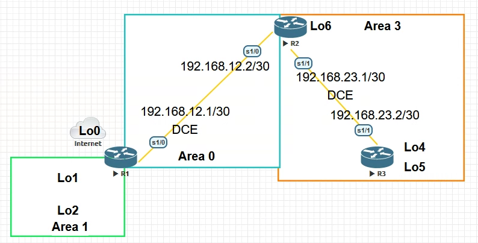

# Laboratory work. Configuring OSPFv2 for multiple areas

## Topology

## The addressing table

| Device | Interface    | IP address      | Subnet Mask     |
| ------ | ------------ | --------------- | --------------- |
| R1     | Lo0          | 209.165.200.225 | 255.255.255.252 |
|        | Lo1          | 192.168.1.1     | 255.255.255.0   |
|        | Lo2          | 192.168.2.1     | 255.255.255.0   |
|        | S0/0/0 (DCE) | 192.168.12.1    | 255.255.255.252 |
| R2     | Lo6          | 192.168.6.1     | 255.255.255.0   |
|        | S0/0/0       | 192.168.12.2    | 255.255.255.252 |
|        | S0/0/1 (DCE) | 192.168.23.1    | 255.255.255.252 |
| R3     | Lo4          | 192.168.4.1     | 255.255.255.0   |
|        | Lo5          | 192.168.5.1     | 255.255.255.0   |
|        | S0/0/1       | 192.168.23.2    | 255.255.255.252 |

## Tasks

**Part 1. Creating a network and configuring basic device parameters**

**Part 2. Configuring the OSPFv2 network for multiple areas**

**Part 3. Setting up inter-regional summary routes**

## Creating a network and configuring basic device settings

R1

<pre><code>
Enable
Configure terminal
hostname R1
Interface loopback 0
ip address 209.165.200.225 255.255.255.252
Interface loopback 1
ip address 192.168.1.1 255.255.255.0
Interface loopback 2
ip address 192.168.2.1 255.255.255.0
exit
interface serial 0/0
ip address 192.168.12.1 255.255.255.252
clock rate 128000
no shutdown
exit
no ip domain-lookup
enable secret class
line vty 0 15
logging synchronous
password cisco
login
exit
line con 0
logging synchronous
password cisco
login
Banner motd "This is a secure system. Authorized Access Only!"
do copy run start
[Enter]
</code></pre>

R2

<pre><code>
Enable
Configure terminal
hostname R2
Interface loopback 6
ip address 192.168.6.1 255.255.255.0
exit
interface serial 0/0
ip address 192.168.12.2 255.255.255.252
no shutdown
exit
interface serial 1/0
ip address 192.168.23.1 255.255.255.252
clock rate 128000
no shutdown
exit
no ip domain-lookup
enable secret class
line vty 0 4
logging synchronous
password cisco
login
exit
line con 0
logging synchronous
password cisco
login
exit
Banner motd "This is a secure system. Authorized Access Only!"
do copy run start
[Enter]
</code></pre>

R3

<pre><code>
enable
configure terminal
hostname R3
interface serial 0/0
ip address 192.168.23.2 255.255.255.252
no shutdown
exit
interface loopback 4
ip address 192.168.4.1 255.255.255.0
exit
interface loopback 5
ip address 192.168.5.1 255.255.255.0
exit
no ip domain-lookup
enable secret class
line vty 0 4
logging synchronous
password cisco
login
exit
line con 0
logging synchronous
password cisco
login
exit
Banner motd "This is a secure system. Authorized Access Only!"
do copy run start
</code></pre>

**Check for connectivity at level 3 of the OSI model.**

Run the **show ip interface brief** command to verify that the IP addressing and activity of the interfaces are correct. Make sure that each router can successfully send echo requests to neighboring routers connected via serial interfaces.

R1

<pre><code>
R1(config)#do show ip interface brief
Interface                  IP-Address      OK? Method Status                Protocol
Ethernet0/0                unassigned      YES unset  administratively down down
Ethernet0/1                unassigned      YES unset  administratively down down
Ethernet0/2                unassigned      YES unset  administratively down down
Ethernet0/3                unassigned      YES unset  administratively down down
Serial1/0                  192.168.12.1    YES manual up                    up
Serial1/1                  unassigned      YES unset  administratively down down
Serial1/2                  unassigned      YES unset  administratively down down
Serial1/3                  unassigned      YES unset  administratively down down
Loopback0                  209.165.200.225 YES manual up                    up
Loopback1                  192.168.1.1     YES manual up                    up
Loopback2                  192.168.2.1     YES manual up                    up
</code></pre>

R2

<pre><code>
R2(config)#do show ip interface brief
Interface                  IP-Address      OK? Method Status                Protocol
Ethernet0/0                unassigned      YES unset  administratively down down
Ethernet0/1                unassigned      YES unset  administratively down down
Ethernet0/2                unassigned      YES unset  administratively down down
Ethernet0/3                unassigned      YES unset  administratively down down
Serial1/0                  192.168.12.2    YES SLARP  up                    up
Serial1/1                  192.168.23.1    YES manual up                    up
Serial1/2                  unassigned      YES unset  administratively down down
Serial1/3                  unassigned      YES unset  administratively down down
Loopback6                  192.168.6.1     YES manual up                    up
</code></pre>

R3

<pre><code>
R3(config)#do show ip interface brief
Interface                  IP-Address      OK? Method Status                Protocol
Ethernet0/0                unassigned      YES unset  administratively down down
Ethernet0/1                unassigned      YES unset  administratively down down
Ethernet0/2                unassigned      YES unset  administratively down down
Ethernet0/3                unassigned      YES unset  administratively down down
Serial1/0                  unassigned      YES unset  administratively down down
Serial1/1                  192.168.23.2    YES SLARP  up                    up
Serial1/2                  unassigned      YES unset  administratively down down
Serial1/3                  unassigned      YES unset  administratively down down
Loopback4                  192.168.4.1     YES manual up                    up
Loopback5                  192.168.5.1     YES manual up                    up
</code></pre>

## Configuring the OSPFv2 network for multiple areas

In Part 2, you need to configure the OSPFv2 network for multiple areas using the process ID 1. All loopback LAN interfaces must be passive, and MD5 authentication with password  **Cisco123** must be configured for all serial interfaces.

### Define the types of OSPF routers in the topology.

- Identify the backbone routers: R1, R2, R3
- Define Autonomous System Edge Routers (ASBR): R1
- Define the Area Boundary Routers (ABR): R1 , R2
- Identify the internal routers: R3

**Configure the OSPF protocol on the R1 router.**

We will set up OSPF networks on R1 , specify passive interfaces , and also tell OSPF about the default route to the Internet.

R1

<pre><code>
router ospf 1
router-id 1.1.1.1
network192.168.1.0 0.0.0.255 area 1
network 192.168.2.0 0.0.0.255 area 1
network 192.168.12.0 0.0.0.3 area 0
passive-interface Loopback1
passive-interface Loopback2
default-information originate
exit
ip route 0.0.0.0 0.0.0.0 loopback 0
do clear ip ospf process
[yes]
</code></pre>

**Configure the OSPF protocol on the R2 router.**

R2

<pre><code>
router ospf 1
router-id 2.2.2.2
network 192.168.6.0 0.0.0.255 area 3
network 192.168.12.0 0.0.0.3 area 0
network 192.168.23.0 0.0.0.3 area 3
passive-interface Loopback6
do clear ip ospf process
[yes]
</code></pre>

**Configure the OSPF protocol on the R3 router.**

R3

<pre><code>
router ospf 1
router-id 3.3.3.3
network 192.168.23.0 0.0.0.3 area 3
passive-interface Loopback4
passive-interface Loopback5
network 192.168.4.0 0.0.0.255 area 3
network 192.168.5.0 0.0.0.255 area 3
do clear ip ospf process
[yes]
</code></pre>

**Make sure that the OSPF protocol is configured correctly and that the adjacency relationship between the routers is established.**

R1

<pre><code>
R1(config)#do show ip protocols
*** IP Routing is NSF aware ***
!
Routing Protocol is "application"
  Sending updates every 0 seconds
  Invalid after 0 seconds, hold down 0, flushed after 0
  Outgoing update filter list for all interfaces is not set
  Incoming update filter list for all interfaces is not set
  Maximum path: 32
  Routing for Networks:
  Routing Information Sources:
    Gateway         Distance      Last Update
  Distance: (default is 4)
!
Routing Protocol is "ospf 1"
  Outgoing update filter list for all interfaces is not set
  Incoming update filter list for all interfaces is not set
  Router ID 1.1.1.1
  It is an area border and autonomous system boundary router
 Redistributing External Routes from,
  Number of areas in this router is 2. 2 normal 0 stub 0 nssa
  Maximum path: 4
  Routing for Networks:
    192.168.2.0 0.0.0.255 area 1
    192.168.12.0 0.0.0.3 area 0
  Passive Interface(s):
    Loopback1
    Loopback2
  Routing Information Sources:
    Gateway         Distance      Last Update
    2.2.2.2              110      00:00:01
  Distance: (default is 110)
!
</code></pre>

R2

<pre><code>
R2(config)#do show ip protocols
*** IP Routing is NSF aware ***
!
Routing Protocol is "application"
  Sending updates every 0 seconds
  Invalid after 0 seconds, hold down 0, flushed after 0
  Outgoing update filter list for all interfaces is not set
  Incoming update filter list for all interfaces is not set
  Maximum path: 32
  Routing for Networks:
  Routing Information Sources:
    Gateway         Distance      Last Update
  Distance: (default is 4)
!
Routing Protocol is "ospf 1"
  Outgoing update filter list for all interfaces is not set
  Incoming update filter list for all interfaces is not set
  Router ID 2.2.2.2
  It is an area border router
  Number of areas in this router is 2. 2 normal 0 stub 0 nssa
  Maximum path: 4
  Routing for Networks:
    192.168.6.0 0.0.0.255 area 3
    192.168.12.0 0.0.0.3 area 0
    192.168.23.0 0.0.0.3 area 3
  Passive Interface(s):
    Loopback6
  Routing Information Sources:
    Gateway         Distance      Last Update
    3.3.3.3              110      00:00:13
    1.1.1.1              110      00:00:53
  Distance: (default is 110)
!
</code></pre>

R3

<pre><code>
R3(config)#do show ip protocols
*** IP Routing is NSF aware ***
!
Routing Protocol is "application"
  Sending updates every 0 seconds
  Invalid after 0 seconds, hold down 0, flushed after 0
  Outgoing update filter list for all interfaces is not set
  Incoming update filter list for all interfaces is not set
  Maximum path: 32
  Routing for Networks:
  Routing Information Sources:
    Gateway         Distance      Last Update
  Distance: (default is 4)
!
Routing Protocol is "ospf 1"
  Outgoing update filter list for all interfaces is not set
  Incoming update filter list for all interfaces is not set
  Router ID 3.3.3.3
  Number of areas in this router is 1. 1 normal 0 stub 0 nssa
  Maximum path: 4
  Routing for Networks:
    192.168.4.0 0.0.0.255 area 3
    192.168.5.0 0.0.0.255 area 3
    192.168.23.0 0.0.0.3 area 3
  Passive Interface(s):
    Loopback4
    Loopback5
  Routing Information Sources:
    Gateway         Distance      Last Update
    1.1.1.1              110      00:00:30
    2.2.2.2              110      00:00:30
  Distance: (default is 110)
!
</code></pre>

**What type of OSPF router does each router belong to?**

- R1: ASBR , ABR, Backbone router
- R2: ABR, Backbone router
- R3: Internal router

Let's make sure that the OSPF adjacency relationship is established between the routers.

R1

<pre><code>
R1#show ip ospf neighbor
!
Neighbor ID     Pri   State           Dead Time   Address         Interface
2.2.2.2           0   FULL/  -        00:00:33    192.168.12.2    Serial1/0
</code></pre>

R2

<pre><code>
R2#show ip ospf neighbor
!
Neighbor ID     Pri   State           Dead Time   Address         Interface
1.1.1.1           0   FULL/  -        00:00:39    192.168.12.1    Serial1/0
3.3.3.3           0   FULL/  -        00:00:37    192.168.23.2    Serial1/1
</code></pre>

R3

<pre><code>
R3#show ip ospf neighbor
!
Neighbor ID     Pri   State           Dead Time   Address         Interface
2.2.2.2           0   FULL/  -        00:00:39    192.168.23.1    Serial1/1
</code></pre>

The command **show ip ospf interface brief** displays a summary of the cost of the interface routes.

R1

<pre><code>
R1#show ip ospf interface brief
Interface    PID   Area            IP Address/Mask    Cost  State Nbrs F/C
Se1/0        1     0               192.168.12.1/30    64    P2P   1/1
Lo2          1     1               192.168.2.1/24     1     LOOP  0/0
</code></pre>

R2

<pre><code>
R2#show ip ospf interface brief
Interface    PID   Area            IP Address/Mask    Cost  State Nbrs F/C
Se1/0        1     0               192.168.12.2/30    64    P2P   1/1
Lo6          1     3               192.168.6.1/24     1     LOOP  0/0
Se1/1        1     3               192.168.23.1/30    64    P2P   1/1
</code></pre>

R3

<pre><code>
R3#show ip ospf interface brief
Interface    PID   Area            IP Address/Mask    Cost  State Nbrs F/C
Lo4          1     3               192.168.4.1/24     1     LOOP  0/0
Lo5          1     3               192.168.5.1/24     1     LOOP  0/0
Se1/1        1     3               192.168.23.2/30    64    P2P   1/1
</code></pre>

### Configure MD5 authentication for all serial interfaces

R1

<pre><code>
interface Serial 1/0
ip ospf authentication message-digest
ip ospf message-digest-key 1 md5 Cisco123
</code></pre>

R2

<pre><code>
interface Serial 0/0
ip ospf authentication message-digest
ip ospf message-digest-key 1 md5 Cisco123
interface Serial 1/0
ip ospf authentication message-digest
ip ospf message-digest-key 1 md5 Cisco123
</code></pre>

R3

<pre><code>
interface Serial 1/0
ip ospf authentication message-digest
ip ospf message-digest-key 1 md5 Cisco123
</code></pre>

Why is it useful to check if OSPF is working correctly before setting up OSPF authentication?

Obviously, in order not to add problems to ourselves, after we write the OSPF process on each router.

### Check the restoration of the OSPF adjacency relationship.

R1

<pre><code>
R1#show ip ospf neighbor
!
Neighbor ID     Pri   State           Dead Time   Address         Interface
2.2.2.2           0   FULL/  -        00:00:33    192.168.12.2    Serial1/0
</code></pre>

R2

<pre><code>
R2#show ip ospf neighbor
!
Neighbor ID     Pri   State           Dead Time   Address         Interface
1.1.1.1           0   FULL/  -        00:00:39    192.168.12.1    Serial1/0
3.3.3.3           0   FULL/  -        00:00:37    192.168.23.2    Serial1/1
</code></pre>

R3

<pre><code>
R3#show ip ospf neighbor
!
Neighbor ID     Pri   State           Dead Time   Address         Interface
2.2.2.2           0   FULL/  -        00:00:39    192.168.23.1    Serial1/1
</code></pre>

## Setting up inter-regional summary routes

R1

<pre><code>
R1(config-if)#do show ip route ospf
Codes: L - local, C - connected, S - static, R - RIP, M - mobile, B - BGP
       D - EIGRP, EX - EIGRP external, O - OSPF, IA - OSPF inter area
       N1 - OSPF NSSA external type 1, N2 - OSPF NSSA external type 2
       E1 - OSPF external type 1, E2 - OSPF external type 2
       i - IS-IS, su - IS-IS summary, L1 - IS-IS level-1, L2 - IS-IS level-2
       ia - IS-IS inter area, * - candidate default, U - per-user static route
       o - ODR, P - periodic downloaded static route, H - NHRP, l - LISP
       a - application route
       + - replicated route, % - next hop override
!
Gateway of last resort is 0.0.0.0 to network 0.0.0.0
!
      192.168.4.0/32 is subnetted, 1 subnets
O IA     192.168.4.1 [110/129] via 192.168.12.2, 00:03:30, Serial1/0
      192.168.5.0/32 is subnetted, 1 subnets
O IA     192.168.5.1 [110/129] via 192.168.12.2, 00:03:30, Serial1/0
      192.168.6.0/32 is subnetted, 1 subnets
O IA     192.168.6.1 [110/65] via 192.168.12.2, 00:04:13, Serial1/0
      192.168.23.0/30 is subnetted, 1 subnets
O IA     192.168.23.0 [110/128] via 192.168.12.2, 00:04:13, Serial1/0
</code></pre>

R2

<pre><code>
R2(config-if)#do show ip route ospf
Codes: L - local, C - connected, S - static, R - RIP, M - mobile, B - BGP
       D - EIGRP, EX - EIGRP external, O - OSPF, IA - OSPF inter area
       N1 - OSPF NSSA external type 1, N2 - OSPF NSSA external type 2
       E1 - OSPF external type 1, E2 - OSPF external type 2
       i - IS-IS, su - IS-IS summary, L1 - IS-IS level-1, L2 - IS-IS level-2
       ia - IS-IS inter area, * - candidate default, U - per-user static route
       o - ODR, P - periodic downloaded static route, H - NHRP, l - LISP
       a - application route
       + - replicated route, % - next hop override
!
Gateway of last resort is 192.168.12.1 to network 0.0.0.0
!
O*E2  0.0.0.0/0 [110/1] via 192.168.12.1, 00:04:29, Serial1/0
      192.168.2.0/32 is subnetted, 1 subnets
O IA     192.168.2.1 [110/65] via 192.168.12.1, 00:04:29, Serial1/0
      192.168.4.0/32 is subnetted, 1 subnets
O        192.168.4.1 [110/65] via 192.168.23.2, 00:03:46, Serial1/1
      192.168.5.0/32 is subnetted, 1 subnets
O        192.168.5.1 [110/65] via 192.168.23.2, 00:03:46, Serial1/1
</code></pre>

R3

<pre><code>
R3(config-if)#do show ip route ospf
Codes: L - local, C - connected, S - static, R - RIP, M - mobile, B - BGP
       D - EIGRP, EX - EIGRP external, O - OSPF, IA - OSPF inter area
       N1 - OSPF NSSA external type 1, N2 - OSPF NSSA external type 2
       E1 - OSPF external type 1, E2 - OSPF external type 2
       i - IS-IS, su - IS-IS summary, L1 - IS-IS level-1, L2 - IS-IS level-2
       ia - IS-IS inter area, * - candidate default, U - per-user static route
       o - ODR, P - periodic downloaded static route, H - NHRP, l - LISP
       a - application route
       + - replicated route, % - next hop override
!
Gateway of last resort is 192.168.23.1 to network 0.0.0.0
!
O*E2  0.0.0.0/0 [110/1] via 192.168.23.1, 00:03:53, Serial1/1
      192.168.2.0/32 is subnetted, 1 subnets
O IA     192.168.2.1 [110/129] via 192.168.23.1, 00:03:53, Serial1/1
      192.168.6.0/32 is subnetted, 1 subnets
O        192.168.6.1 [110/65] via 192.168.23.1, 00:03:53, Serial1/1
      192.168.12.0/30 is subnetted, 1 subnets
O IA     192.168.12.0 [110/128] via 192.168.23.1, 00:03:53, Serial1/1
</code></pre>

All routes marked as (O IA) are inter-regional routes.

### Просмотрите базы данных LSDB на всех маршрутизаторах
